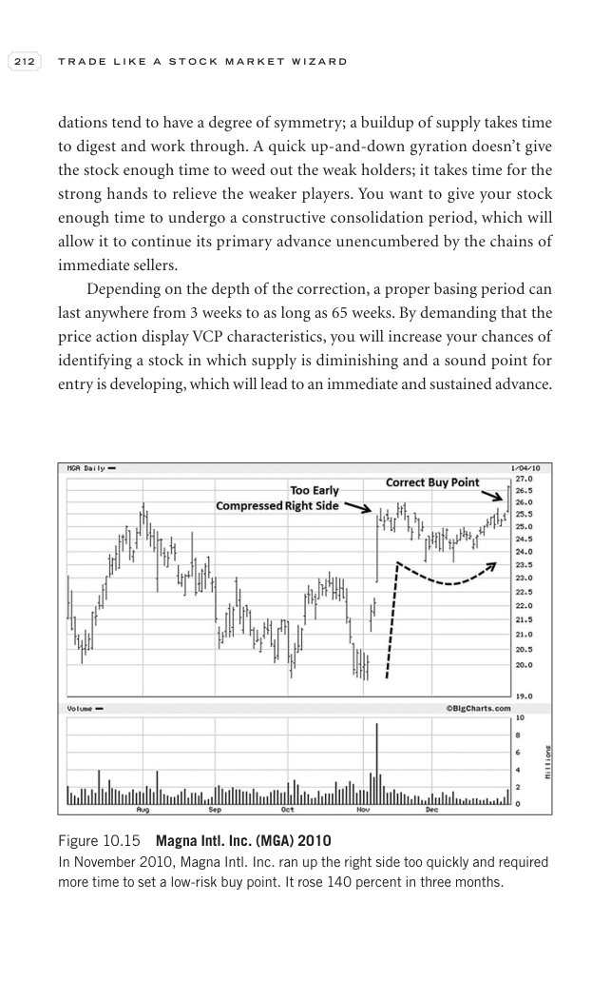

# Trade Like a Stock Market Wizard - Page Image 227

## Source Page

Book: [[Trade Like a Stock Market Wizard]]

## Page Read

Tags: pivot-breakout, risk-first, sell-or-failure, stage-2-leadership, stock-chart-page, vcp-or-tightening, volume-dry-up

Concepts: [[Pivot and Entry]], [[Relative Strength Leadership]], [[Risk First]], [[Sell Rules and Failure Signals]], [[Stage 2 Uptrend]], [[Trend Template]], [[Volatility Contraction Pattern]], [[Volume Dry-Up and Accumulation]]

This page contains one or more stock-chart figures already reconciled in the stock-image layer. Study the source page first for the visual lesson, then open the linked case notes to compare it against rebuilt OHLCV data.

## Linked Stock Figures

- [[Trade Like a Stock Market Wizard - Figure 10-15 - MGA - page 227]] - MGA - vcp-or-tightening; pivot-breakout; volume-dry-up; stage-2-leadership

## Extracted Page Text Signal

212 T R A D E L I K E A S T O C K M A R K E T W I Z A R D dations tend to have a degree of symmetry; a buildup of supply takes time to digest and work through. A quick up-and-down gyration doesn’t give the stock enough time to weed out the weak holders; it takes time for the strong hands to relieve the weaker players. You want to give your stock enough time to undergo a constructive consolidation period, which will allow it to continue its primary advance unencumbered by the chains of immediate ...

## Manual Study Prompt

- What visual structure is the page trying to make obvious?
- Is the lesson about buying, avoiding, selling, or managing risk?
- If a ticker is not present, what generic behavior does the image teach?
- If a ticker is present, does the linked OHLCV rebuild confirm the same behavior?
