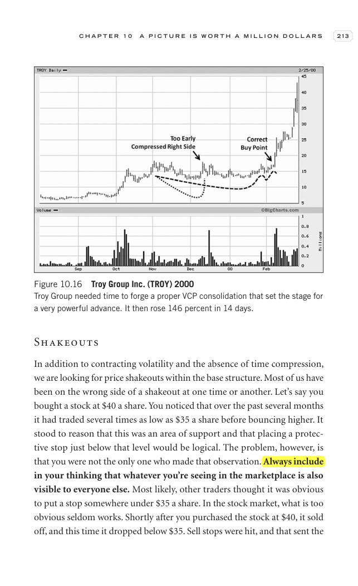

# Trade Like a Stock Market Wizard - Page Image 228

## Source Page

Book: [[Trade Like a Stock Market Wizard]]

## Page Read

Tags: manual-review-needed, risk-first, sell-or-failure, stock-chart-page

Concepts: [[Mental Discipline]], [[Risk First]], [[Sell Rules and Failure Signals]]

This page contains one or more stock-chart figures already reconciled in the stock-image layer. Study the source page first for the visual lesson, then open the linked case notes to compare it against rebuilt OHLCV data.

## Linked Stock Figures

- [[Trade Like a Stock Market Wizard - Figure 10-16 - TROY - page 228]] - TROY - manual-review-needed

## Extracted Page Text Signal

C H A P T E R 1 0 A P I C T U R E I S W O R T H A M I L L I O N D O L L A R S 213 Shakeouts In addition to contracting volatility and the absence of time compression, we are looking for price shakeouts within the base structure. Most of us have been on the wrong side of a shakeout at one time or another. Let’s say you bought a stock at $40 a share. You noticed that over the past several months it had traded several times as low as $35 a share before bouncing higher. It stood to reason that this ...

## Manual Study Prompt

- What visual structure is the page trying to make obvious?
- Is the lesson about buying, avoiding, selling, or managing risk?
- If a ticker is not present, what generic behavior does the image teach?
- If a ticker is present, does the linked OHLCV rebuild confirm the same behavior?
