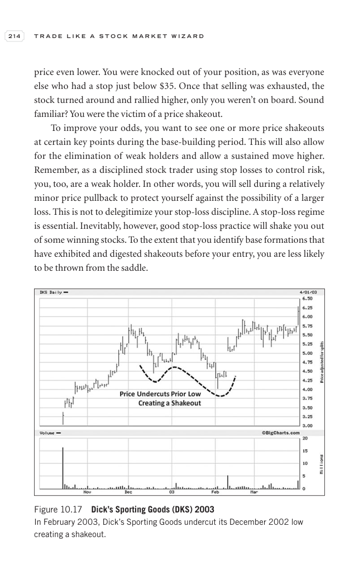

# Trade Like a Stock Market Wizard - Page Image 229

## Source Page

Book: [[Trade Like a Stock Market Wizard]]

## Page Read

Tags: mental-discipline, risk-first, sell-or-failure, shakeout, stage-2-leadership, stock-chart-page, vcp-or-tightening

Concepts: [[Mental Discipline]], [[Pivot and Entry]], [[Relative Strength Leadership]], [[Risk First]], [[Sell Rules and Failure Signals]], [[Stage 2 Uptrend]], [[Trend Template]], [[Volatility Contraction Pattern]], [[Volume Dry-Up and Accumulation]]

This page contains one or more stock-chart figures already reconciled in the stock-image layer. Study the source page first for the visual lesson, then open the linked case notes to compare it against rebuilt OHLCV data.

## Linked Stock Figures

- [[Trade Like a Stock Market Wizard - Figure 10-17 - DKS - page 229]] - DKS - vcp-or-tightening; shakeout; stage-2-leadership

## Extracted Page Text Signal

214 T R A D E L I K E A S T O C K M A R K E T W I Z A R D price even lower. You were knocked out of your position, as was everyone else who had a stop just below $35. Once that selling was exhausted, the stock turned around and rallied higher, only you weren’t on board. Sound familiar? You were the victim of a price shakeout. To improve your odds, you want to see one or more price shakeouts at certain key points during the base-building period. This will also allow for the elimination of weak ho...

## Manual Study Prompt

- What visual structure is the page trying to make obvious?
- Is the lesson about buying, avoiding, selling, or managing risk?
- If a ticker is not present, what generic behavior does the image teach?
- If a ticker is present, does the linked OHLCV rebuild confirm the same behavior?
