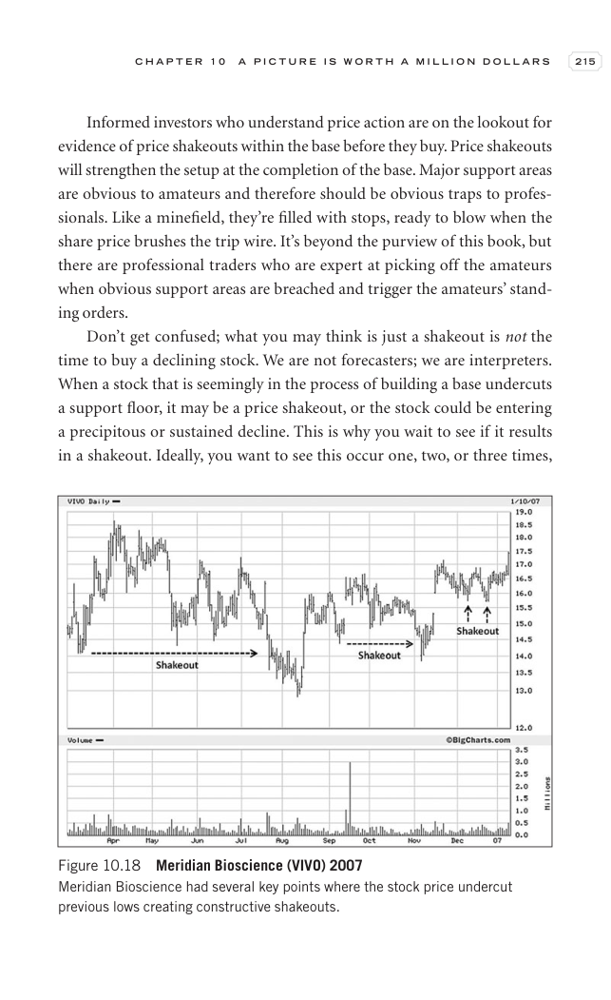

# Trade Like a Stock Market Wizard - Page Image 230

## Source Page

Book: [[Trade Like a Stock Market Wizard]]

## Page Read

Tags: manual-review-needed, risk-first, stock-chart-page

Concepts: [[Mental Discipline]], [[Risk First]]

This page contains one or more stock-chart figures already reconciled in the stock-image layer. Study the source page first for the visual lesson, then open the linked case notes to compare it against rebuilt OHLCV data.

## Linked Stock Figures

- [[Trade Like a Stock Market Wizard - Figure 10-18 - VIVO - page 230]] - VIVO - manual-review-needed

## Extracted Page Text Signal

C H A P T E R 1 0 A P I C T U R E I S W O R T H A M I L L I O N D O L L A R S 215 Informed investors who understand price action are on the lookout for evidence of price shakeouts within the base before they buy. Price shakeouts will strengthen the setup at the completion of the base. Major support areas are obvious to amateurs and therefore should be obvious traps to profes- sionals. Like a minefield, they’re filled with stops, ready to blow when the share price brushes the trip wire. It’s beyond...

## Manual Study Prompt

- What visual structure is the page trying to make obvious?
- Is the lesson about buying, avoiding, selling, or managing risk?
- If a ticker is not present, what generic behavior does the image teach?
- If a ticker is present, does the linked OHLCV rebuild confirm the same behavior?
