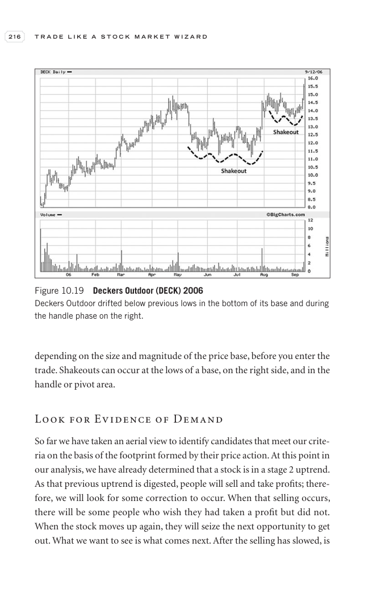

# Trade Like a Stock Market Wizard - Page Image 231

## Source Page

Book: [[Trade Like a Stock Market Wizard]]

## Page Read

Tags: pivot-or-entry, sell-or-failure, stage-2-leadership, stage-2-uptrend, stock-chart-page

Concepts: [[Pivot and Entry]], [[Relative Strength Leadership]], [[Sell Rules and Failure Signals]], [[Stage 2 Uptrend]], [[Trend Template]]

This page contains one or more stock-chart figures already reconciled in the stock-image layer. Study the source page first for the visual lesson, then open the linked case notes to compare it against rebuilt OHLCV data.

## Linked Stock Figures

- [[Trade Like a Stock Market Wizard - Figure 10-19 - DECK - page 231]] - DECK - stage-2-leadership

## Extracted Page Text Signal

216 T R A D E L I K E A S T O C K M A R K E T W I Z A R D depending on the size and magnitude of the price base, before you enter the trade. Shakeouts can occur at the lows of a base, on the right side, and in the handle or pivot area. Look for Evidence of Demand So far we have taken an aerial view to identify candidates that meet our crite- ria on the basis of the footprint formed by their price action. At this point in our analysis, we have already determined that a stock is in a stage 2 uptre...

## Manual Study Prompt

- What visual structure is the page trying to make obvious?
- Is the lesson about buying, avoiding, selling, or managing risk?
- If a ticker is not present, what generic behavior does the image teach?
- If a ticker is present, does the linked OHLCV rebuild confirm the same behavior?
