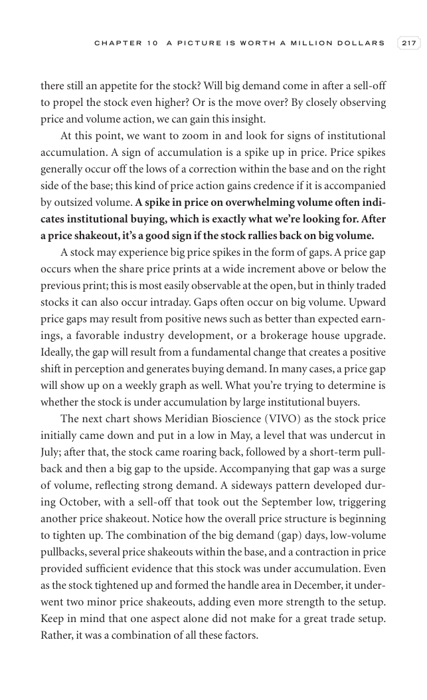

# Trade Like a Stock Market Wizard - Page Image 232

## Source Page

Book: [[Trade Like a Stock Market Wizard]]

## Page Read

Tags: sell-or-failure, visual-concept-page, volume-behavior

Concepts: [[Mental Discipline]], [[Sell Rules and Failure Signals]], [[Volume Dry-Up and Accumulation]]

This is a visual teaching page without a clean ticker/date case. The useful work is to read the image as a concept illustration rather than forcing a market-data reconstruction.

## Linked Stock Figures

- No extracted stock-figure case on this page.

## Extracted Page Text Signal

C H A P T E R 1 0 A P I C T U R E I S W O R T H A M I L L I O N D O L L A R S 217 there still an appetite for the stock? Will big demand come in after a sell-off to propel the stock even higher? Or is the move over? By closely observing price and volume action, we can gain this insight. At this point, we want to zoom in and look for signs of institutional accumulation. A sign of accumulation is a spike up in price. Price spikes generally occur off the lows of a correction within the base and on ...

## Manual Study Prompt

- What visual structure is the page trying to make obvious?
- Is the lesson about buying, avoiding, selling, or managing risk?
- If a ticker is not present, what generic behavior does the image teach?
- If a ticker is present, does the linked OHLCV rebuild confirm the same behavior?
