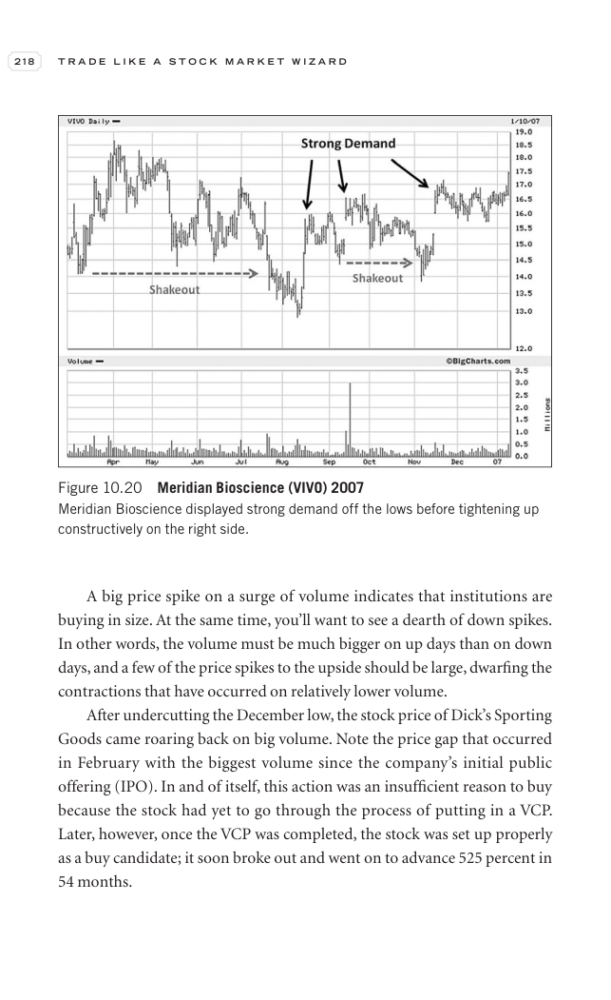

# Trade Like a Stock Market Wizard - Page Image 233

## Source Page

Book: [[Trade Like a Stock Market Wizard]]

## Page Read

Tags: ipo-or-new-issue, manual-review-needed, stock-chart-page, vcp-or-tightening, volume-behavior

Concepts: [[IPO Base New Issue Setup|IPO Base / New Issue Setup]], [[Mental Discipline]], [[Volatility Contraction Pattern]], [[Volume Dry-Up and Accumulation]]

This page contains one or more stock-chart figures already reconciled in the stock-image layer. Study the source page first for the visual lesson, then open the linked case notes to compare it against rebuilt OHLCV data.

## Linked Stock Figures

- [[Trade Like a Stock Market Wizard - Figure 10-20 - VIVO - page 233]] - VIVO - manual-review-needed

## Extracted Page Text Signal

218 T R A D E L I K E A S T O C K M A R K E T W I Z A R D A big price spike on a surge of volume indicates that institutions are buying in size. At the same time, you’ll want to see a dearth of down spikes. In other words, the volume must be much bigger on up days than on down days, and a few of the price spikes to the upside should be large, dwarfing the contractions that have occurred on relatively lower volume. After undercutting the December low, the stock price of Dick’s Sporting Goods came ...

## Manual Study Prompt

- What visual structure is the page trying to make obvious?
- Is the lesson about buying, avoiding, selling, or managing risk?
- If a ticker is not present, what generic behavior does the image teach?
- If a ticker is present, does the linked OHLCV rebuild confirm the same behavior?
