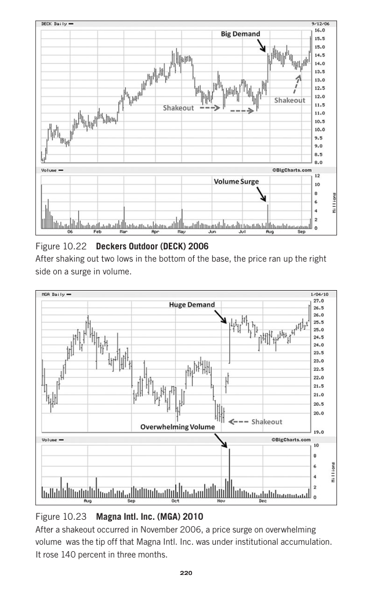

# Trade Like a Stock Market Wizard - Page Image 235

## Source Page

Book: [[Trade Like a Stock Market Wizard]]

## Page Read

Tags: shakeout, stage-2-leadership, stock-chart-page, volume-behavior

Concepts: [[Relative Strength Leadership]], [[Risk First]], [[Stage 2 Uptrend]], [[Trend Template]], [[Volatility Contraction Pattern]], [[Volume Dry-Up and Accumulation]]

This page contains one or more stock-chart figures already reconciled in the stock-image layer. Study the source page first for the visual lesson, then open the linked case notes to compare it against rebuilt OHLCV data.

## Linked Stock Figures

- [[Trade Like a Stock Market Wizard - Figure 10-22 - DECK - page 235]] - DECK - stage-2-leadership
- [[Trade Like a Stock Market Wizard - Figure 10-23 - MGA - page 235]] - MGA - shakeout; stage-2-leadership

## Extracted Page Text Signal

220 220 Figure 10.22 Deckers Outdoor (DECK) 2006 After shaking out two lows in the bottom of the base, the price ran up the right side on a surge in volume. Figure 10.23 Magna Intl. Inc. (MGA) 2010 After a shakeout occurred in November 2006, a price surge on overwhelming volume was the tip off that Magna Intl. Inc. was under institutional accumulation. It rose 140 percent in three months

## Manual Study Prompt

- What visual structure is the page trying to make obvious?
- Is the lesson about buying, avoiding, selling, or managing risk?
- If a ticker is not present, what generic behavior does the image teach?
- If a ticker is present, does the linked OHLCV rebuild confirm the same behavior?
