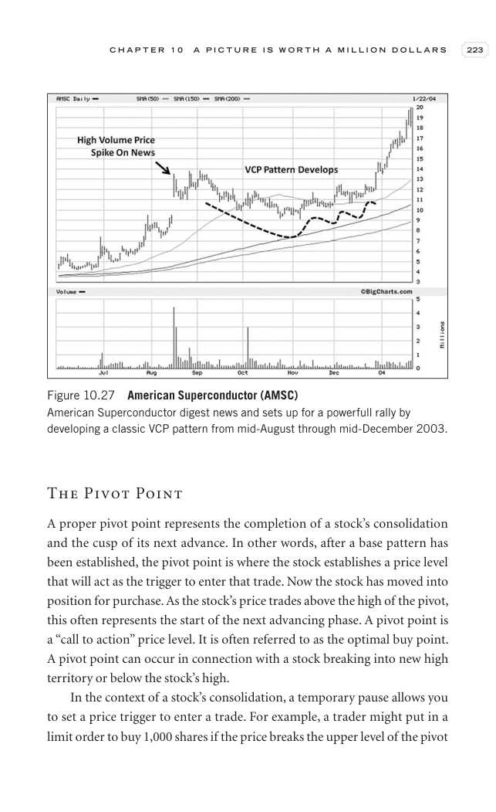

# Trade Like a Stock Market Wizard - Page Image 238

## Source Page

Book: [[Trade Like a Stock Market Wizard]]

## Page Read

Tags: pivot-or-entry, stage-2-leadership, stock-chart-page, vcp-or-tightening

Concepts: [[Pivot and Entry]], [[Relative Strength Leadership]], [[Stage 2 Uptrend]], [[Trend Template]], [[Volatility Contraction Pattern]], [[Volume Dry-Up and Accumulation]]

This page contains one or more stock-chart figures already reconciled in the stock-image layer. Study the source page first for the visual lesson, then open the linked case notes to compare it against rebuilt OHLCV data.

## Linked Stock Figures

- [[Trade Like a Stock Market Wizard - Figure 10-27 - AMSC - page 238]] - AMSC - vcp-or-tightening; stage-2-leadership

## Extracted Page Text Signal

C H A P T E R 1 0 A P I C T U R E I S W O R T H A M I L L I O N D O L L A R S 223 The Pivot Point A proper pivot point represents the completion of a stock’s consolidation and the cusp of its next advance. In other words, after a base pattern has been established, the pivot point is where the stock establishes a price level that will act as the trigger to enter that trade. Now the stock has moved into position for purchase. As the stock’s price trades above the high of the pivot, this often repr...

## Manual Study Prompt

- What visual structure is the page trying to make obvious?
- Is the lesson about buying, avoiding, selling, or managing risk?
- If a ticker is not present, what generic behavior does the image teach?
- If a ticker is present, does the linked OHLCV rebuild confirm the same behavior?
