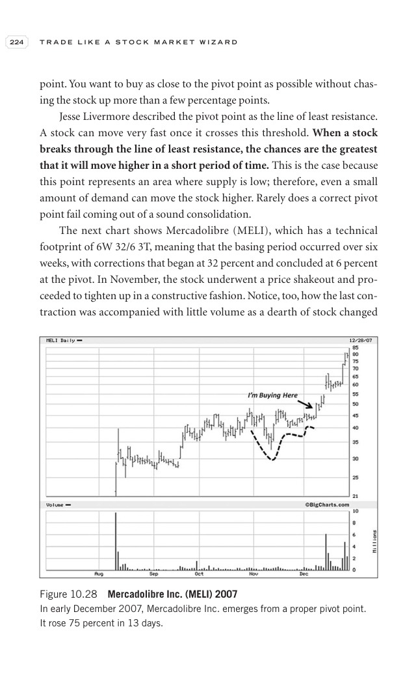

# Trade Like a Stock Market Wizard - Page Image 239

## Source Page

Book: [[Trade Like a Stock Market Wizard]]

## Page Read

Tags: pivot-breakout, pivot-or-entry, stage-2-leadership, stock-chart-page, volume-behavior

Concepts: [[Pivot and Entry]], [[Relative Strength Leadership]], [[Stage 2 Uptrend]], [[Trend Template]], [[Volume Dry-Up and Accumulation]]

This page contains one or more stock-chart figures already reconciled in the stock-image layer. Study the source page first for the visual lesson, then open the linked case notes to compare it against rebuilt OHLCV data.

## Linked Stock Figures

- [[Trade Like a Stock Market Wizard - Figure 10-28 - MELI - page 239]] - MELI - pivot-breakout; stage-2-leadership

## Extracted Page Text Signal

224 T R A D E L I K E A S T O C K M A R K E T W I Z A R D point. You want to buy as close to the pivot point as possible without chas- ing the stock up more than a few percentage points. Jesse Livermore described the pivot point as the line of least resistance. A stock can move very fast once it crosses this threshold. When a stock breaks through the line of least resistance, the chances are the greatest that it will move higher in a short period of time. This is the case because this point repr...

## Manual Study Prompt

- What visual structure is the page trying to make obvious?
- Is the lesson about buying, avoiding, selling, or managing risk?
- If a ticker is not present, what generic behavior does the image teach?
- If a ticker is present, does the linked OHLCV rebuild confirm the same behavior?
