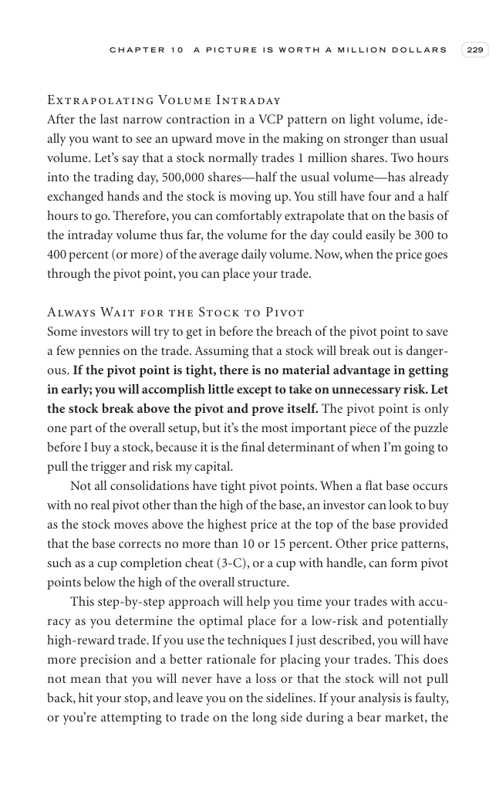

# Trade Like a Stock Market Wizard - Page Image 244

## Source Page

Book: [[Trade Like a Stock Market Wizard]]

## Page Read

Tags: pivot-or-entry, risk-first, vcp-or-tightening, visual-concept-page, volume-behavior

Concepts: [[Mental Discipline]], [[Pivot and Entry]], [[Risk First]], [[Volatility Contraction Pattern]], [[Volume Dry-Up and Accumulation]]

This is a visual teaching page without a clean ticker/date case. The useful work is to read the image as a concept illustration rather than forcing a market-data reconstruction.

## Linked Stock Figures

- No extracted stock-figure case on this page.

## Extracted Page Text Signal

C H A P T E R 1 0 A P I C T U R E I S W O R T H A M I L L I O N D O L L A R S 229 Extrapolating Volume Intraday After the last narrow contraction in a VCP pattern on light volume, ide- ally you want to see an upward move in the making on stronger than usual volume. Let’s say that a stock normally trades 1 million shares. Two hours into the trading day, 500,000 shares-half the usual volume-has already exchanged hands and the stock is moving up. You still have four and a half hours to go. Therefor...

## Manual Study Prompt

- What visual structure is the page trying to make obvious?
- Is the lesson about buying, avoiding, selling, or managing risk?
- If a ticker is not present, what generic behavior does the image teach?
- If a ticker is present, does the linked OHLCV rebuild confirm the same behavior?
