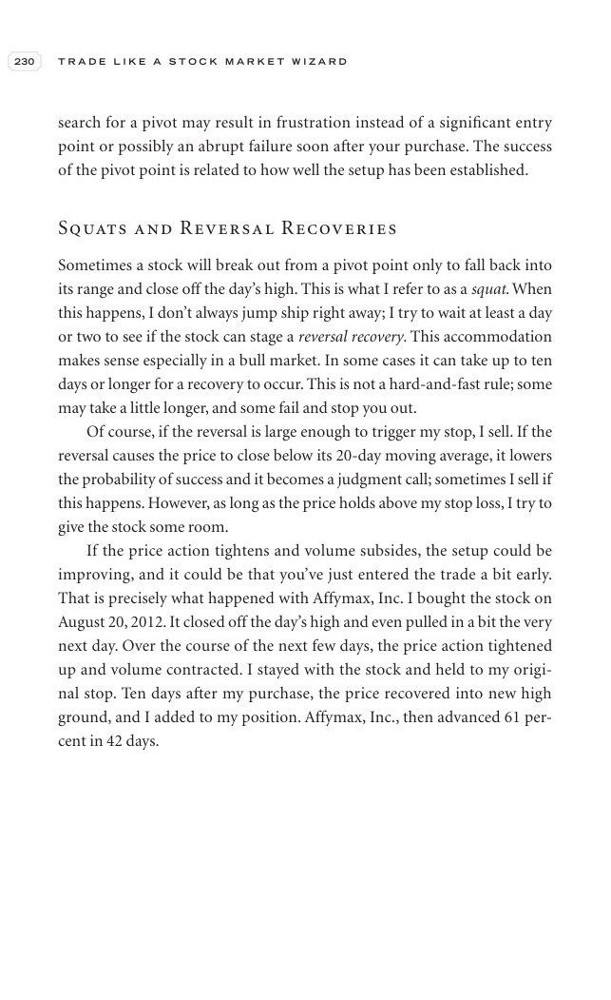

# Trade Like a Stock Market Wizard - Page Image 245

## Source Page

Book: [[Trade Like a Stock Market Wizard]]

## Page Read

Tags: pivot-or-entry, risk-first, sell-or-failure, visual-concept-page, volume-behavior

Concepts: [[Mental Discipline]], [[Pivot and Entry]], [[Risk First]], [[Sell Rules and Failure Signals]], [[Volume Dry-Up and Accumulation]]

This is a visual teaching page without a clean ticker/date case. The useful work is to read the image as a concept illustration rather than forcing a market-data reconstruction.

## Linked Stock Figures

- No extracted stock-figure case on this page.

## Extracted Page Text Signal

230 T R A D E L I K E A S T O C K M A R K E T W I Z A R D search for a pivot may result in frustration instead of a significant entry point or possibly an abrupt failure soon after your purchase. The success of the pivot point is related to how well the setup has been established. Squats and Reversal Recoveries Sometimes a stock will break out from a pivot point only to fall back into its range and close off the day’s high. This is what I refer to as a squat. When this happens, I don’t always jum...

## Manual Study Prompt

- What visual structure is the page trying to make obvious?
- Is the lesson about buying, avoiding, selling, or managing risk?
- If a ticker is not present, what generic behavior does the image teach?
- If a ticker is present, does the linked OHLCV rebuild confirm the same behavior?
