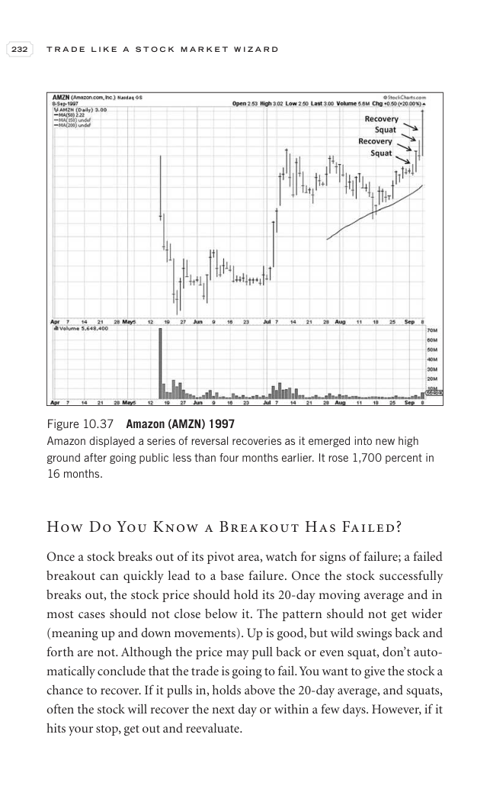

# Trade Like a Stock Market Wizard - Page Image 247

## Source Page

Book: [[Trade Like a Stock Market Wizard]]

## Page Read

Tags: pivot-breakout, pivot-or-entry, risk-first, sell-or-failure, stage-2-leadership, stock-chart-page, vcp-or-tightening

Concepts: [[Pivot and Entry]], [[Relative Strength Leadership]], [[Risk First]], [[Sell Rules and Failure Signals]], [[Stage 2 Uptrend]], [[Trend Template]], [[Volatility Contraction Pattern]], [[Volume Dry-Up and Accumulation]]

This page contains one or more stock-chart figures already reconciled in the stock-image layer. Study the source page first for the visual lesson, then open the linked case notes to compare it against rebuilt OHLCV data.

## Linked Stock Figures

- [[Trade Like a Stock Market Wizard - Figure 10-37 - AMZN - page 247]] - AMZN - vcp-or-tightening; pivot-breakout; stage-2-leadership

## Extracted Page Text Signal

232 T R A D E L I K E A S T O C K M A R K E T W I Z A R D How Do You Know a Breakout Has Failed? Once a stock breaks out of its pivot area, watch for signs of failure; a failed breakout can quickly lead to a base failure. Once the stock successfully breaks out, the stock price should hold its 20-day moving average and in most cases should not close below it. The pattern should not get wider (meaning up and down movements). Up is good, but wild swings back and forth are not. Although the price ma...

## Manual Study Prompt

- What visual structure is the page trying to make obvious?
- Is the lesson about buying, avoiding, selling, or managing risk?
- If a ticker is not present, what generic behavior does the image teach?
- If a ticker is present, does the linked OHLCV rebuild confirm the same behavior?
