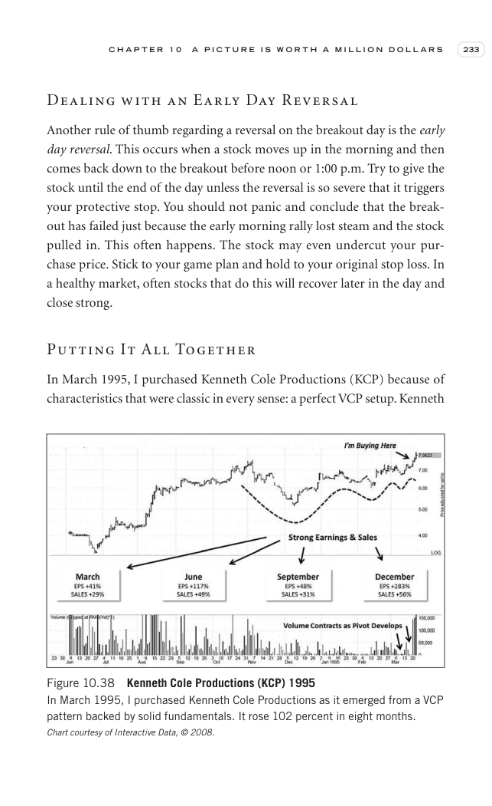

# Trade Like a Stock Market Wizard - Page Image 248

## Source Page

Book: [[Trade Like a Stock Market Wizard]]

## Page Read

Tags: manual-review-needed, pivot-or-entry, risk-first, stock-chart-page

Concepts: [[Mental Discipline]], [[Pivot and Entry]], [[Risk First]]

This page contains one or more stock-chart figures already reconciled in the stock-image layer. Study the source page first for the visual lesson, then open the linked case notes to compare it against rebuilt OHLCV data.

## Linked Stock Figures

- [[Trade Like a Stock Market Wizard - Figure 10-38 - KCP - page 248]] - KCP - manual-review-needed

## Extracted Page Text Signal

C H A P T E R 1 0 A P I C T U R E I S W O R T H A M I L L I O N D O L L A R S 233 Dealing with an Early Day Reversal Another rule of thumb regarding a reversal on the breakout day is the early day reversal. This occurs when a stock moves up in the morning and then comes back down to the breakout before noon or 1:00 p.m. Try to give the stock until the end of the day unless the reversal is so severe that it triggers your protective stop. You should not panic and conclude that the break- out has f...

## Manual Study Prompt

- What visual structure is the page trying to make obvious?
- Is the lesson about buying, avoiding, selling, or managing risk?
- If a ticker is not present, what generic behavior does the image teach?
- If a ticker is present, does the linked OHLCV rebuild confirm the same behavior?
