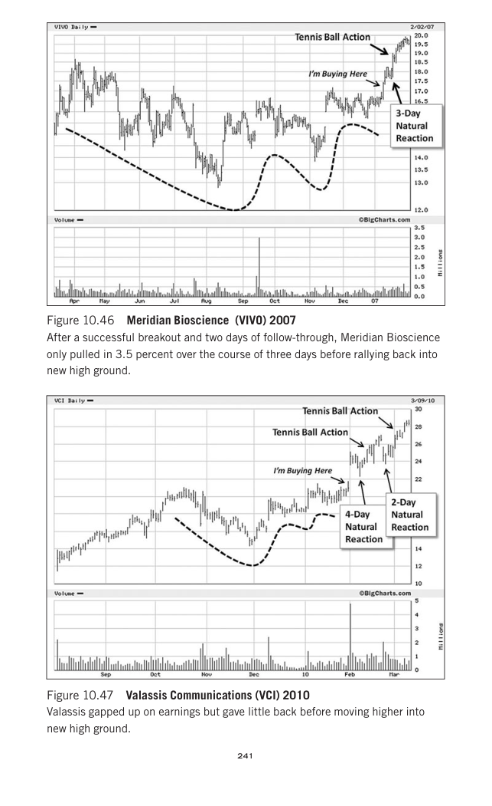

# Trade Like a Stock Market Wizard - Page Image 256

## Source Page

Book: [[Trade Like a Stock Market Wizard]]

## Page Read

Tags: manual-review-needed, pivot-or-entry, stock-chart-page

Concepts: [[Mental Discipline]], [[Pivot and Entry]]

This page contains one or more stock-chart figures already reconciled in the stock-image layer. Study the source page first for the visual lesson, then open the linked case notes to compare it against rebuilt OHLCV data.

## Linked Stock Figures

- [[Trade Like a Stock Market Wizard - Figure 10-46 - VIVO - page 256]] - VIVO - manual-review-needed
- [[Trade Like a Stock Market Wizard - Figure 10-47 - VCI - page 256]] - VCI - manual-review-needed

## Extracted Page Text Signal

241 Figure 10.46 Meridian Bioscience (VIVO) 2007 After a successful breakout and two days of follow-through, Meridian Bioscience only pulled in 3.5 percent over the course of three days before rallying back into new high ground. Figure 10.47 Valassis Communications (VCI) 2010 Valassis gapped up on earnings but gave little back before moving higher into new high ground

## Manual Study Prompt

- What visual structure is the page trying to make obvious?
- Is the lesson about buying, avoiding, selling, or managing risk?
- If a ticker is not present, what generic behavior does the image teach?
- If a ticker is present, does the linked OHLCV rebuild confirm the same behavior?
