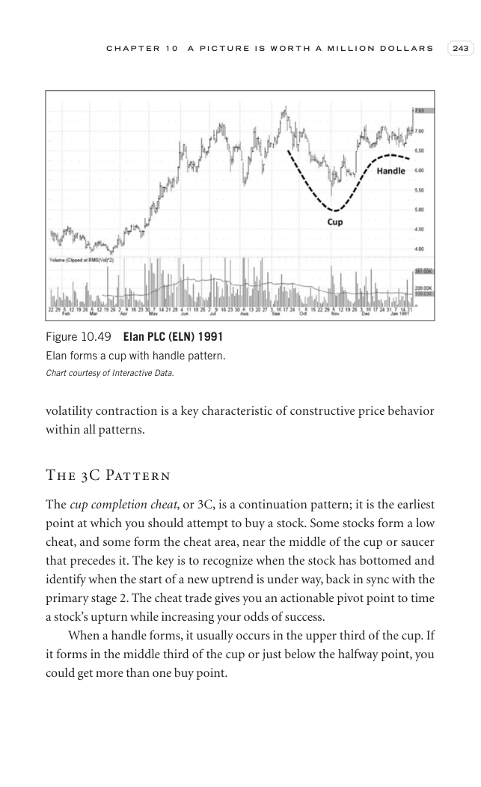

# Trade Like a Stock Market Wizard - Page Image 258

## Source Page

Book: [[Trade Like a Stock Market Wizard]]

## Page Read

Tags: manual-review-needed, pivot-or-entry, stage-2-uptrend, stock-chart-page, vcp-or-tightening

Concepts: [[Mental Discipline]], [[Pivot and Entry]], [[Stage 2 Uptrend]], [[Volatility Contraction Pattern]]

This page contains one or more stock-chart figures already reconciled in the stock-image layer. Study the source page first for the visual lesson, then open the linked case notes to compare it against rebuilt OHLCV data.

## Linked Stock Figures

- [[Trade Like a Stock Market Wizard - Figure 10-49 - ELN - page 258]] - ELN - manual-review-needed

## Extracted Page Text Signal

C H A P T E R 1 0 A P I C T U R E I S W O R T H A M I L L I O N D O L L A R S 243 volatility contraction is a key characteristic of constructive price behavior within all patterns. The 3C Pattern The cup completion cheat, or 3C, is a continuation pattern; it is the earliest point at which you should attempt to buy a stock. Some stocks form a low cheat, and some form the cheat area, near the middle of the cup or saucer that precedes it. The key is to recognize when the stock has bottomed and iden...

## Manual Study Prompt

- What visual structure is the page trying to make obvious?
- Is the lesson about buying, avoiding, selling, or managing risk?
- If a ticker is not present, what generic behavior does the image teach?
- If a ticker is present, does the linked OHLCV rebuild confirm the same behavior?
