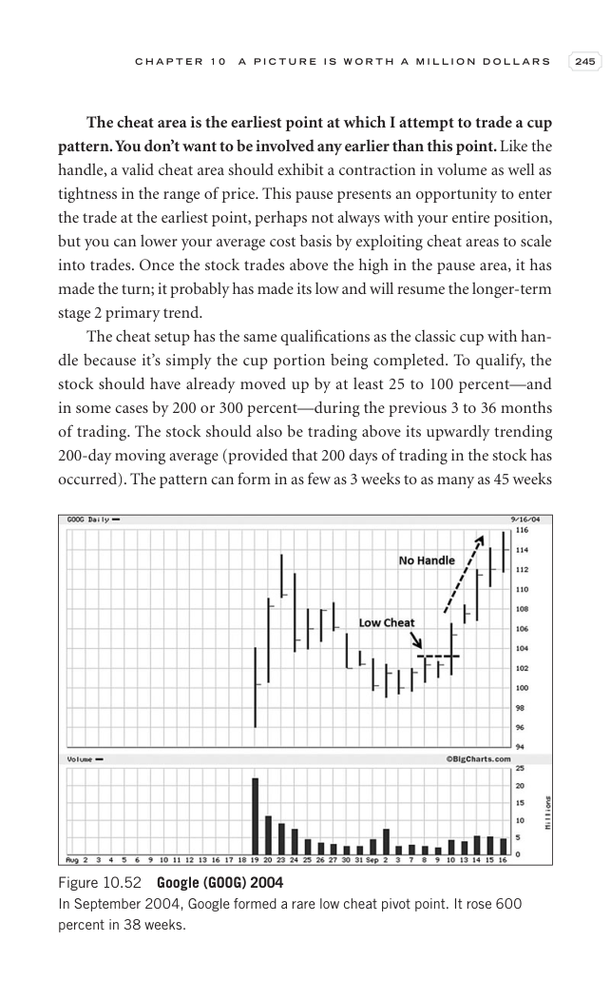

# Trade Like a Stock Market Wizard - Page Image 260

## Source Page

Book: [[Trade Like a Stock Market Wizard]]

## Page Read

Tags: cheat-entry, pivot-breakout, pivot-or-entry, stage-2-leadership, stage-2-uptrend, stock-chart-page, vcp-or-tightening, volume-behavior, volume-dry-up

Concepts: [[Pivot and Entry]], [[Relative Strength Leadership]], [[Stage 2 Uptrend]], [[Trend Template]], [[Volatility Contraction Pattern]], [[Volume Dry-Up and Accumulation]]

This page contains one or more stock-chart figures already reconciled in the stock-image layer. Study the source page first for the visual lesson, then open the linked case notes to compare it against rebuilt OHLCV data.

## Linked Stock Figures

- [[Trade Like a Stock Market Wizard - Figure 10-52 - GOOG - page 260]] - GOOG - vcp-or-tightening; pivot-breakout; cheat-entry; volume-dry-up; stage-2-leadership

## Extracted Page Text Signal

C H A P T E R 1 0 A P I C T U R E I S W O R T H A M I L L I O N D O L L A R S 245 The cheat area is the earliest point at which I attempt to trade a cup pattern. You don’t want to be involved any earlier than this point. Like the handle, a valid cheat area should exhibit a contraction in volume as well as tightness in the range of price. This pause presents an opportunity to enter the trade at the earliest point, perhaps not always with your entire position, but you can lower your average cost b...

## Manual Study Prompt

- What visual structure is the page trying to make obvious?
- Is the lesson about buying, avoiding, selling, or managing risk?
- If a ticker is not present, what generic behavior does the image teach?
- If a ticker is present, does the linked OHLCV rebuild confirm the same behavior?
