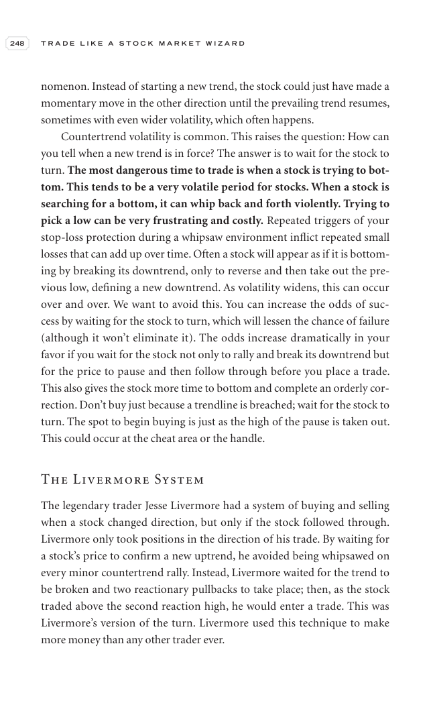

# Trade Like a Stock Market Wizard - Page Image 263

## Source Page

Book: [[Trade Like a Stock Market Wizard]]

## Page Read

Tags: risk-first, sell-or-failure, visual-concept-page

Concepts: [[Mental Discipline]], [[Risk First]], [[Sell Rules and Failure Signals]]

This is a visual teaching page without a clean ticker/date case. The useful work is to read the image as a concept illustration rather than forcing a market-data reconstruction.

## Linked Stock Figures

- No extracted stock-figure case on this page.

## Extracted Page Text Signal

248 T R A D E L I K E A S T O C K M A R K E T W I Z A R D nomenon. Instead of starting a new trend, the stock could just have made a momentary move in the other direction until the prevailing trend resumes, sometimes with even wider volatility, which often happens. Countertrend volatility is common. This raises the question: How can you tell when a new trend is in force? The answer is to wait for the stock to turn. The most dangerous time to trade is when a stock is trying to bot- tom. This tend...

## Manual Study Prompt

- What visual structure is the page trying to make obvious?
- Is the lesson about buying, avoiding, selling, or managing risk?
- If a ticker is not present, what generic behavior does the image teach?
- If a ticker is present, does the linked OHLCV rebuild confirm the same behavior?
