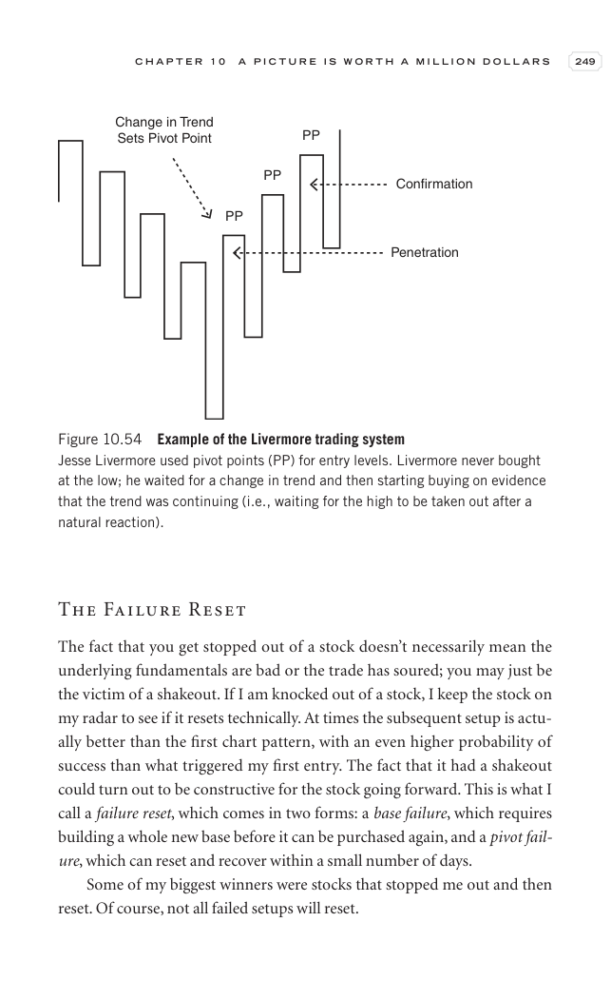

# Trade Like a Stock Market Wizard - Page Image 264

## Source Page

Book: [[Trade Like a Stock Market Wizard]]

## Page Read

Tags: manual-review-needed, pivot-or-entry, risk-first, sell-or-failure, stock-chart-page

Concepts: [[Mental Discipline]], [[Pivot and Entry]], [[Risk First]], [[Sell Rules and Failure Signals]]

This page contains one or more stock-chart figures already reconciled in the stock-image layer. Study the source page first for the visual lesson, then open the linked case notes to compare it against rebuilt OHLCV data.

## Linked Stock Figures

- [[Trade Like a Stock Market Wizard - Figure 10-54 - PP - page 264]] - PP - manual-review-needed

## Extracted Page Text Signal

C H A P T E R 1 0 A P I C T U R E I S W O R T H A M I L L I O N D O L L A R S 249 The Failure Reset The fact that you get stopped out of a stock doesn’t necessarily mean the underlying fundamentals are bad or the trade has soured; you may just be the victim of a shakeout. If I am knocked out of a stock, I keep the stock on my radar to see if it resets technically. At times the subsequent setup is actu- ally better than the first chart pattern, with an even higher probability of success than what ...

## Manual Study Prompt

- What visual structure is the page trying to make obvious?
- Is the lesson about buying, avoiding, selling, or managing risk?
- If a ticker is not present, what generic behavior does the image teach?
- If a ticker is present, does the linked OHLCV rebuild confirm the same behavior?
