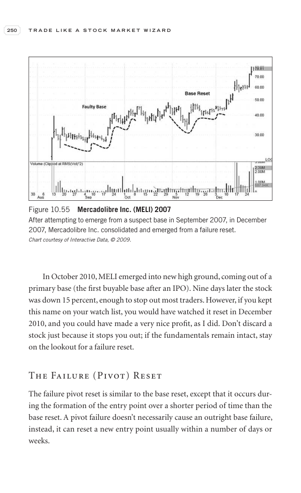

# Trade Like a Stock Market Wizard - Page Image 265

## Source Page

Book: [[Trade Like a Stock Market Wizard]]

## Page Read

Tags: ipo-or-new-issue, pivot-breakout, pivot-or-entry, risk-first, sell-or-failure, stage-2-leadership, stock-chart-page, vcp-or-tightening

Concepts: [[IPO Base New Issue Setup|IPO Base / New Issue Setup]], [[Pivot and Entry]], [[Relative Strength Leadership]], [[Risk First]], [[Sell Rules and Failure Signals]], [[Stage 2 Uptrend]], [[Trend Template]], [[Volatility Contraction Pattern]], [[Volume Dry-Up and Accumulation]]

This page contains one or more stock-chart figures already reconciled in the stock-image layer. Study the source page first for the visual lesson, then open the linked case notes to compare it against rebuilt OHLCV data.

## Linked Stock Figures

- [[Trade Like a Stock Market Wizard - Figure 10-55 - MELI - page 265]] - MELI - vcp-or-tightening; pivot-breakout; stage-2-leadership

## Extracted Page Text Signal

250 T R A D E L I K E A S T O C K M A R K E T W I Z A R D In October 2010, MELI emerged into new high ground, coming out of a primary base (the first buyable base after an IPO). Nine days later the stock was down 15 percent, enough to stop out most traders. However, if you kept this name on your watch list, you would have watched it reset in December 2010, and you could have made a very nice profit, as I did. Don’t discard a stock just because it stops you out; if the fundamentals remain intact, s...

## Manual Study Prompt

- What visual structure is the page trying to make obvious?
- Is the lesson about buying, avoiding, selling, or managing risk?
- If a ticker is not present, what generic behavior does the image teach?
- If a ticker is present, does the linked OHLCV rebuild confirm the same behavior?
