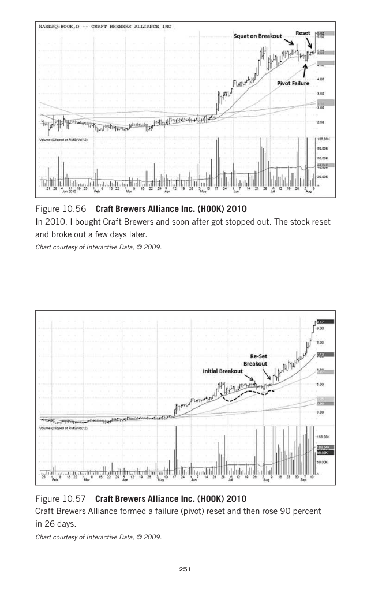

# Trade Like a Stock Market Wizard - Page Image 266

## Source Page

Book: [[Trade Like a Stock Market Wizard]]

## Page Read

Tags: manual-review-needed, pivot-or-entry, risk-first, sell-or-failure, stock-chart-page

Concepts: [[Mental Discipline]], [[Pivot and Entry]], [[Risk First]], [[Sell Rules and Failure Signals]]

This page contains one or more stock-chart figures already reconciled in the stock-image layer. Study the source page first for the visual lesson, then open the linked case notes to compare it against rebuilt OHLCV data.

## Linked Stock Figures

- [[Trade Like a Stock Market Wizard - Figure 10-56 - HOOK - page 266]] - HOOK - manual-review-needed
- [[Trade Like a Stock Market Wizard - Figure 10-57 - HOOK - page 266]] - HOOK - manual-review-needed

## Extracted Page Text Signal

251 Figure 10.56 Craft Brewers Alliance Inc. (HOOK) 2010 In 2010, I bought Craft Brewers and soon after got stopped out. The stock reset and broke out a few days later. Chart courtesy of Interactive Data, © 2009. Figure 10.57 Craft Brewers Alliance Inc. (HOOK) 2010 Craft Brewers Alliance formed a failure (pivot) reset and then rose 90 percent in 26 days. Chart courtesy of Interactive Data, © 2009

## Manual Study Prompt

- What visual structure is the page trying to make obvious?
- Is the lesson about buying, avoiding, selling, or managing risk?
- If a ticker is not present, what generic behavior does the image teach?
- If a ticker is present, does the linked OHLCV rebuild confirm the same behavior?
