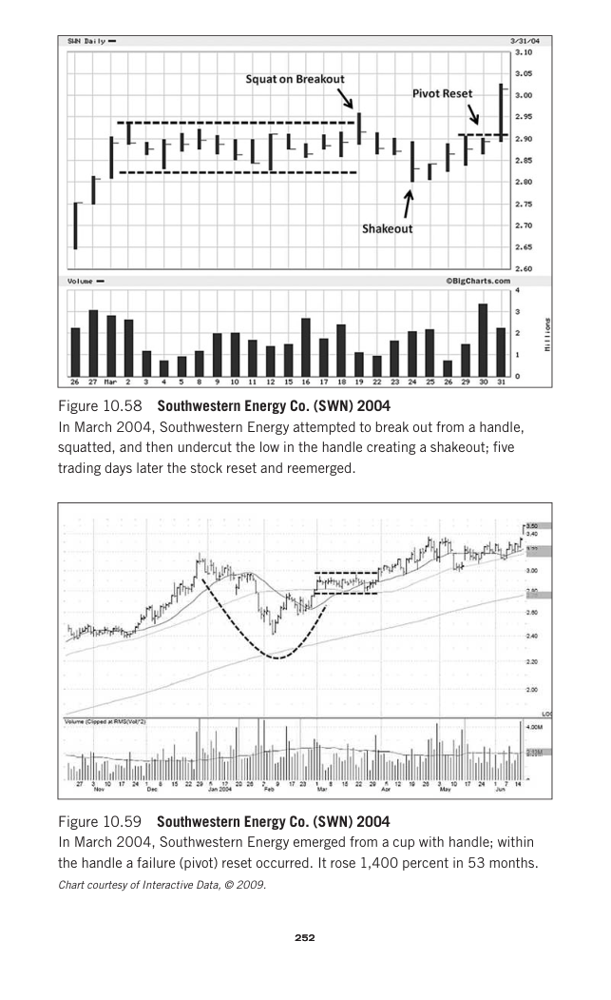

# Trade Like a Stock Market Wizard - Page Image 267

## Source Page

Book: [[Trade Like a Stock Market Wizard]]

## Page Read

Tags: manual-review-needed, pivot-or-entry, sell-or-failure, stock-chart-page

Concepts: [[Mental Discipline]], [[Pivot and Entry]], [[Sell Rules and Failure Signals]]

This page contains one or more stock-chart figures already reconciled in the stock-image layer. Study the source page first for the visual lesson, then open the linked case notes to compare it against rebuilt OHLCV data.

## Linked Stock Figures

- [[Trade Like a Stock Market Wizard - Figure 10-58 - SWN - page 267]] - SWN - manual-review-needed
- [[Trade Like a Stock Market Wizard - Figure 10-59 - SWN - page 267]] - SWN - manual-review-needed

## Extracted Page Text Signal

252 252 Figure 10.58 Southwestern Energy Co. (SWN) 2004 In March 2004, Southwestern Energy attempted to break out from a handle, squatted, and then undercut the low in the handle creating a shakeout; five trading days later the stock reset and reemerged. Figure 10.59 Southwestern Energy Co. (SWN) 2004 In March 2004, Southwestern Energy emerged from a cup with handle; within the handle a failure (pivot) reset occurred. It rose 1,400 percent in 53 months. Chart courtesy of Interactive Data, © 2009

## Manual Study Prompt

- What visual structure is the page trying to make obvious?
- Is the lesson about buying, avoiding, selling, or managing risk?
- If a ticker is not present, what generic behavior does the image teach?
- If a ticker is present, does the linked OHLCV rebuild confirm the same behavior?
