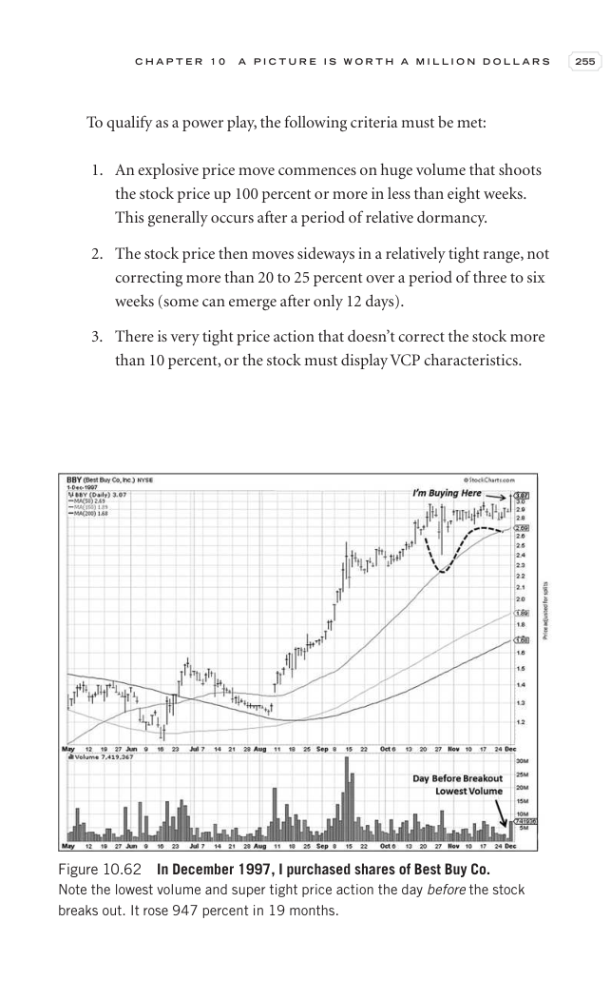

# Trade Like a Stock Market Wizard - Page Image 270

## Source Page

Book: [[Trade Like a Stock Market Wizard]]

## Page Read

Tags: manual-review-needed, stock-chart-page, volume-behavior

Concepts: [[Mental Discipline]], [[Volume Dry-Up and Accumulation]]

This page contains one or more stock-chart figures already reconciled in the stock-image layer. Study the source page first for the visual lesson, then open the linked case notes to compare it against rebuilt OHLCV data.

## Linked Stock Figures

- [[Trade Like a Stock Market Wizard - Figure 10-62 - manual-review - page 270]] - manual - manual-review-needed

## Extracted Page Text Signal

C H A P T E R 1 0 A P I C T U R E I S W O R T H A M I L L I O N D O L L A R S 255 To qualify as a power play, the following criteria must be met: 1. An explosive price move commences on huge volume that shoots the stock price up 100 percent or more in less than eight weeks. This generally occurs after a period of relative dormancy. 2. The stock price then moves sideways in a relatively tight range, not correcting more than 20 to 25 percent over a period of three to six weeks (some can emerge aft...

## Manual Study Prompt

- What visual structure is the page trying to make obvious?
- Is the lesson about buying, avoiding, selling, or managing risk?
- If a ticker is not present, what generic behavior does the image teach?
- If a ticker is present, does the linked OHLCV rebuild confirm the same behavior?
