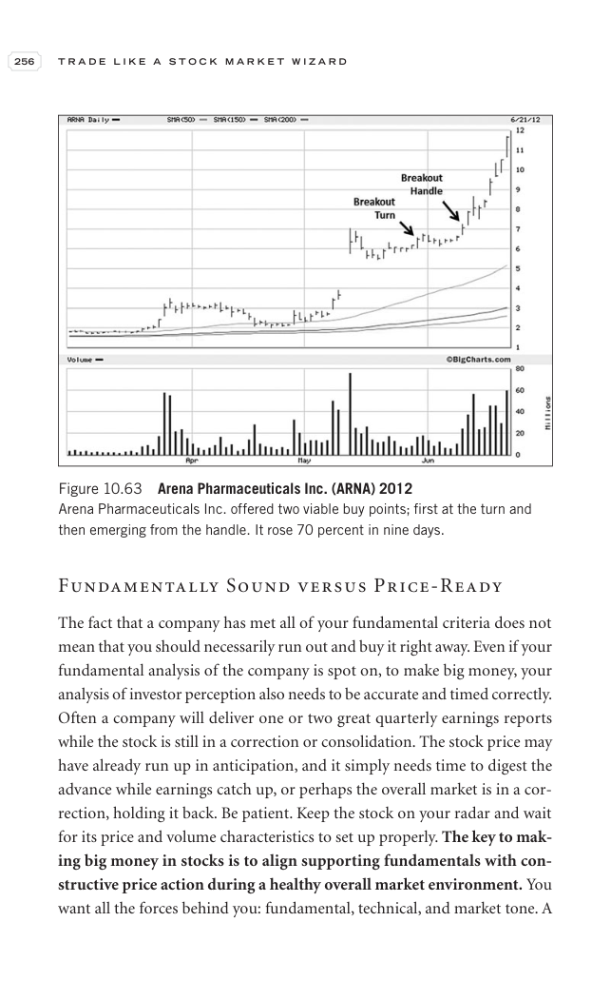

# Trade Like a Stock Market Wizard - Page Image 271

## Source Page

Book: [[Trade Like a Stock Market Wizard]]

## Page Read

Tags: manual-review-needed, stock-chart-page, volume-behavior

Concepts: [[Mental Discipline]], [[Volume Dry-Up and Accumulation]]

This page contains one or more stock-chart figures already reconciled in the stock-image layer. Study the source page first for the visual lesson, then open the linked case notes to compare it against rebuilt OHLCV data.

## Linked Stock Figures

- [[Trade Like a Stock Market Wizard - Figure 10-63 - ARNA - page 271]] - ARNA - manual-review-needed

## Extracted Page Text Signal

256 T R A D E L I K E A S T O C K M A R K E T W I Z A R D Fundamentally Sound versus Price-Ready The fact that a company has met all of your fundamental criteria does not mean that you should necessarily run out and buy it right away. Even if your fundamental analysis of the company is spot on, to make big money, your analysis of investor perception also needs to be accurate and timed correctly. Often a company will deliver one or two great quarterly earnings reports while the stock is still in ...

## Manual Study Prompt

- What visual structure is the page trying to make obvious?
- Is the lesson about buying, avoiding, selling, or managing risk?
- If a ticker is not present, what generic behavior does the image teach?
- If a ticker is present, does the linked OHLCV rebuild confirm the same behavior?
