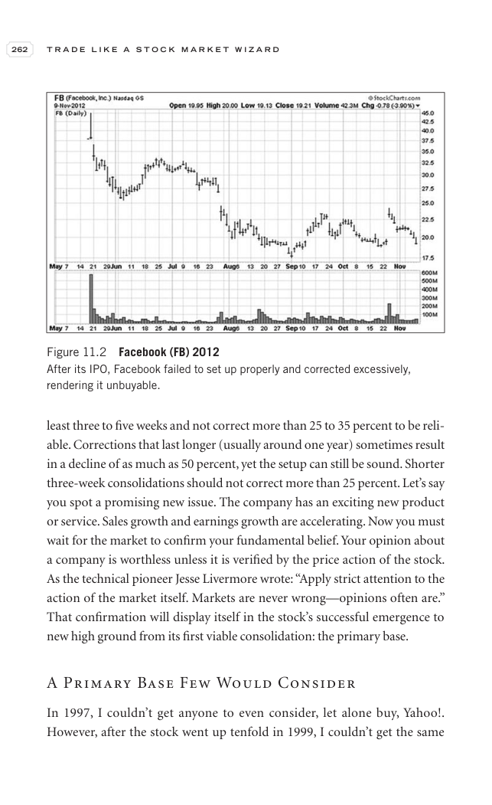

# Trade Like a Stock Market Wizard - Page Image 277

## Source Page

Book: [[Trade Like a Stock Market Wizard]]

## Page Read

Tags: ipo-base, ipo-or-new-issue, manual-review-needed, stock-chart-page

Concepts: [[IPO Base New Issue Setup|IPO Base / New Issue Setup]]

This page contains one or more stock-chart figures already reconciled in the stock-image layer. Study the source page first for the visual lesson, then open the linked case notes to compare it against rebuilt OHLCV data.

## Linked Stock Figures

- [[Trade Like a Stock Market Wizard - Figure 11-2 - FB - page 277]] - FB - manual-review-needed; ipo-base

## Extracted Page Text Signal

262 T R A D E L I K E A S T O C K M A R K E T W I Z A R D least three to five weeks and not correct more than 25 to 35 percent to be reli- able. Corrections that last longer (usually around one year) sometimes result in a decline of as much as 50 percent, yet the setup can still be sound. Shorter three-week consolidations should not correct more than 25 percent. Let’s say you spot a promising new issue. The company has an exciting new product or service. Sales growth and earnings growth are accel...

## Manual Study Prompt

- What visual structure is the page trying to make obvious?
- Is the lesson about buying, avoiding, selling, or managing risk?
- If a ticker is not present, what generic behavior does the image teach?
- If a ticker is present, does the linked OHLCV rebuild confirm the same behavior?
