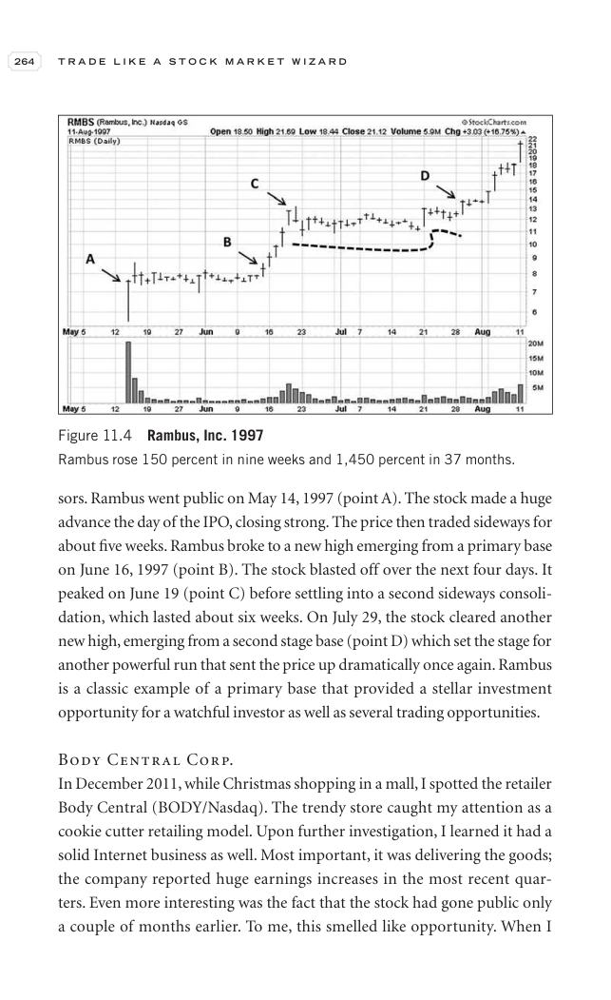

# Trade Like a Stock Market Wizard - Page Image 279

## Source Page

Book: [[Trade Like a Stock Market Wizard]]

## Page Read

Tags: ipo-or-new-issue, manual-review-needed, stock-chart-page

Concepts: [[IPO Base New Issue Setup|IPO Base / New Issue Setup]], [[Mental Discipline]]

This page contains one or more stock-chart figures already reconciled in the stock-image layer. Study the source page first for the visual lesson, then open the linked case notes to compare it against rebuilt OHLCV data.

## Linked Stock Figures

- [[Trade Like a Stock Market Wizard - Figure 11-4 - manual-review - page 279]] - manual - manual-review-needed

## Extracted Page Text Signal

264 T R A D E L I K E A S T O C K M A R K E T W I Z A R D sors. Rambus went public on May 14, 1997 (point A). The stock made a huge advance the day of the IPO, closing strong. The price then traded sideways for about five weeks. Rambus broke to a new high emerging from a primary base on June 16, 1997 (point B). The stock blasted off over the next four days. It peaked on June 19 (point C) before settling into a second sideways consoli- dation, which lasted about six weeks. On July 29, the stock cl...

## Manual Study Prompt

- What visual structure is the page trying to make obvious?
- Is the lesson about buying, avoiding, selling, or managing risk?
- If a ticker is not present, what generic behavior does the image teach?
- If a ticker is present, does the linked OHLCV rebuild confirm the same behavior?
