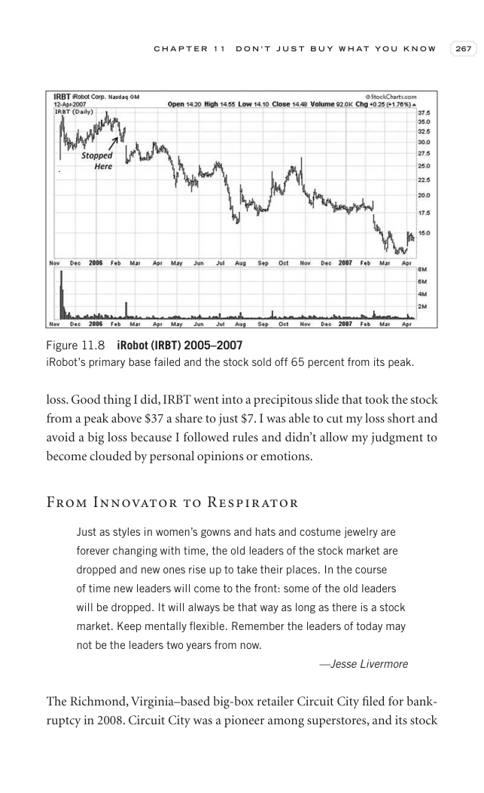

# Trade Like a Stock Market Wizard - Page Image 282

## Source Page

Book: [[Trade Like a Stock Market Wizard]]

## Page Read

Tags: manual-review-needed, stock-chart-page

Concepts: [[Mental Discipline]]

This page contains one or more stock-chart figures already reconciled in the stock-image layer. Study the source page first for the visual lesson, then open the linked case notes to compare it against rebuilt OHLCV data.

## Linked Stock Figures

- [[Trade Like a Stock Market Wizard - Figure 11-8 - IRBT - page 282]] - IRBT - manual-review-needed

## Extracted Page Text Signal

C H A P T E R 1 1 D O N ’ T J U S T B U Y W H A T Y O U K N O W 267 loss. Good thing I did, IRBT went into a precipitous slide that took the stock from a peak above $37 a share to just $7. I was able to cut my loss short and avoid a big loss because I followed rules and didn’t allow my judgment to become clouded by personal opinions or emotions. From Innovator to Respirator Just as styles in women’s gowns and hats and costume jewelry are forever changing with time, the old leaders of the stock m...

## Manual Study Prompt

- What visual structure is the page trying to make obvious?
- Is the lesson about buying, avoiding, selling, or managing risk?
- If a ticker is not present, what generic behavior does the image teach?
- If a ticker is present, does the linked OHLCV rebuild confirm the same behavior?
