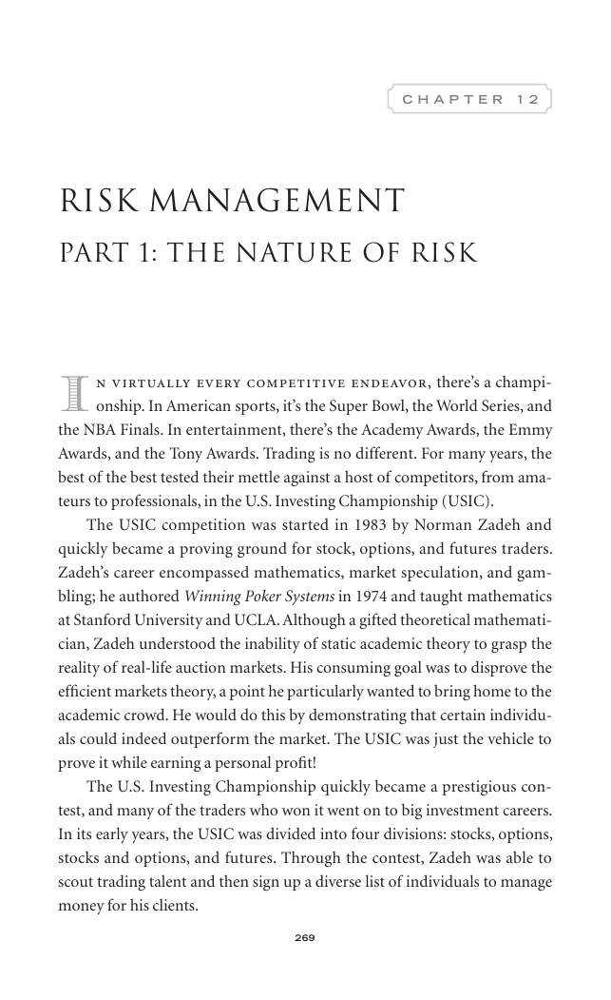

# Trade Like a Stock Market Wizard - Page Image 284

## Source Page

Book: [[Trade Like a Stock Market Wizard]]

## Page Read

Tags: risk-first, visual-concept-page

Concepts: [[Mental Discipline]], [[Risk First]]

This is a visual teaching page without a clean ticker/date case. The useful work is to read the image as a concept illustration rather than forcing a market-data reconstruction.

## Linked Stock Figures

- No extracted stock-figure case on this page.

## Extracted Page Text Signal

269 C H A P T E R 1 2 Risk Management Part 1: The Nature of Risk I n virtually every competitive endeavor, there’s a champi- onship. In American sports, it’s the Super Bowl, the World Series, and the NBA Finals. In entertainment, there’s the Academy Awards, the Emmy Awards, and the Tony Awards. Trading is no different. For many years, the best of the best tested their mettle against a host of competitors, from ama- teurs to professionals, in the U.S. Investing Championship (USIC). The USIC compe...

## Manual Study Prompt

- What visual structure is the page trying to make obvious?
- Is the lesson about buying, avoiding, selling, or managing risk?
- If a ticker is not present, what generic behavior does the image teach?
- If a ticker is present, does the linked OHLCV rebuild confirm the same behavior?
