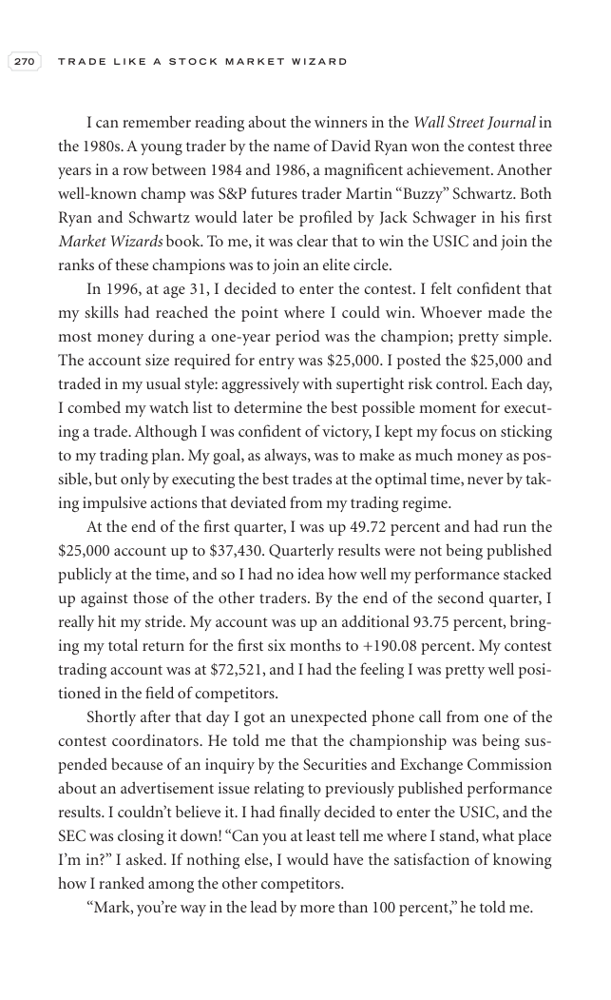

# Trade Like a Stock Market Wizard - Page Image 285

## Source Page

Book: [[Trade Like a Stock Market Wizard]]

## Page Read

Tags: risk-first, visual-concept-page

Concepts: [[Mental Discipline]], [[Risk First]]

This is a visual teaching page without a clean ticker/date case. The useful work is to read the image as a concept illustration rather than forcing a market-data reconstruction.

## Linked Stock Figures

- No extracted stock-figure case on this page.

## Extracted Page Text Signal

270 T R A D E L I K E A S T O C K M A R K E T W I Z A R D I can remember reading about the winners in the Wall Street Journal in the 1980s. A young trader by the name of David Ryan won the contest three years in a row between 1984 and 1986, a magnificent achievement. Another well-known champ was S&P futures trader Martin “Buzzy” Schwartz. Both Ryan and Schwartz would later be profiled by Jack Schwager in his first Market Wizards book. To me, it was clear that to win the USIC and join the ranks of t...

## Manual Study Prompt

- What visual structure is the page trying to make obvious?
- Is the lesson about buying, avoiding, selling, or managing risk?
- If a ticker is not present, what generic behavior does the image teach?
- If a ticker is present, does the linked OHLCV rebuild confirm the same behavior?
