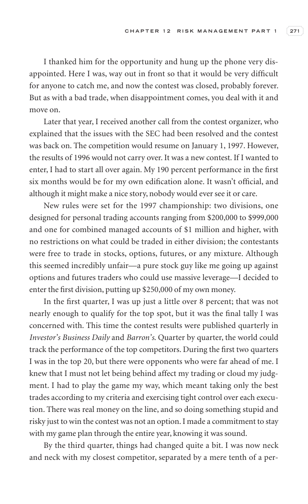

# Trade Like a Stock Market Wizard - Page Image 286

## Source Page

Book: [[Trade Like a Stock Market Wizard]]

## Page Read

Tags: visual-concept-page

Concepts: [[Mental Discipline]]

This is a visual teaching page without a clean ticker/date case. The useful work is to read the image as a concept illustration rather than forcing a market-data reconstruction.

## Linked Stock Figures

- No extracted stock-figure case on this page.

## Extracted Page Text Signal

C H A P T E R 1 2 R I S K M A N A G E M E N T P A R T 1 271 I thanked him for the opportunity and hung up the phone very dis- appointed. Here I was, way out in front so that it would be very difficult for anyone to catch me, and now the contest was closed, probably forever. But as with a bad trade, when disappointment comes, you deal with it and move on. Later that year, I received another call from the contest organizer, who explained that the issues with the SEC had been resolved and the contes...

## Manual Study Prompt

- What visual structure is the page trying to make obvious?
- Is the lesson about buying, avoiding, selling, or managing risk?
- If a ticker is not present, what generic behavior does the image teach?
- If a ticker is present, does the linked OHLCV rebuild confirm the same behavior?
