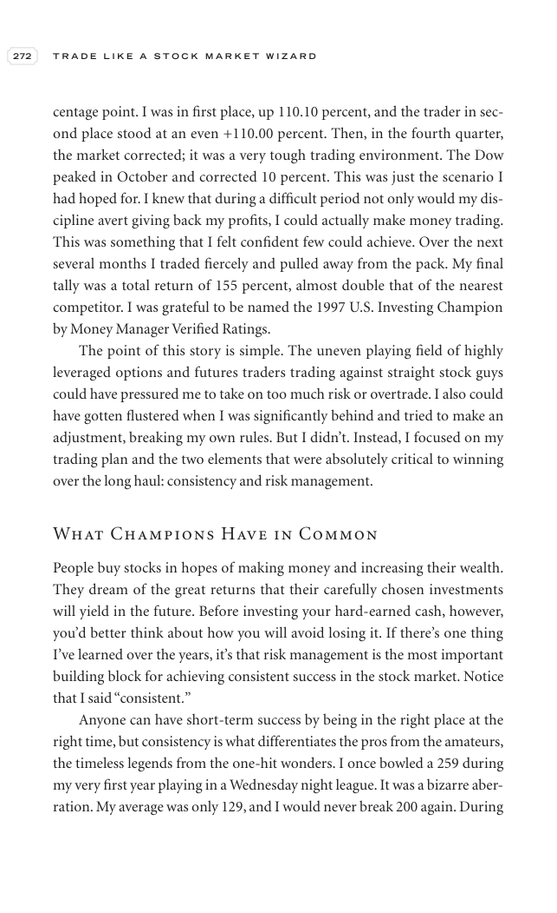

# Trade Like a Stock Market Wizard - Page Image 287

## Source Page

Book: [[Trade Like a Stock Market Wizard]]

## Page Read

Tags: risk-first, visual-concept-page

Concepts: [[Mental Discipline]], [[Risk First]]

This is a visual teaching page without a clean ticker/date case. The useful work is to read the image as a concept illustration rather than forcing a market-data reconstruction.

## Linked Stock Figures

- No extracted stock-figure case on this page.

## Extracted Page Text Signal

272 T R A D E L I K E A S T O C K M A R K E T W I Z A R D centage point. I was in first place, up 110.10 percent, and the trader in sec- ond place stood at an even +110.00 percent. Then, in the fourth quarter, the market corrected; it was a very tough trading environment. The Dow peaked in October and corrected 10 percent. This was just the scenario I had hoped for. I knew that during a difficult period not only would my dis- cipline avert giving back my profits, I could actually make money trading...

## Manual Study Prompt

- What visual structure is the page trying to make obvious?
- Is the lesson about buying, avoiding, selling, or managing risk?
- If a ticker is not present, what generic behavior does the image teach?
- If a ticker is present, does the linked OHLCV rebuild confirm the same behavior?
