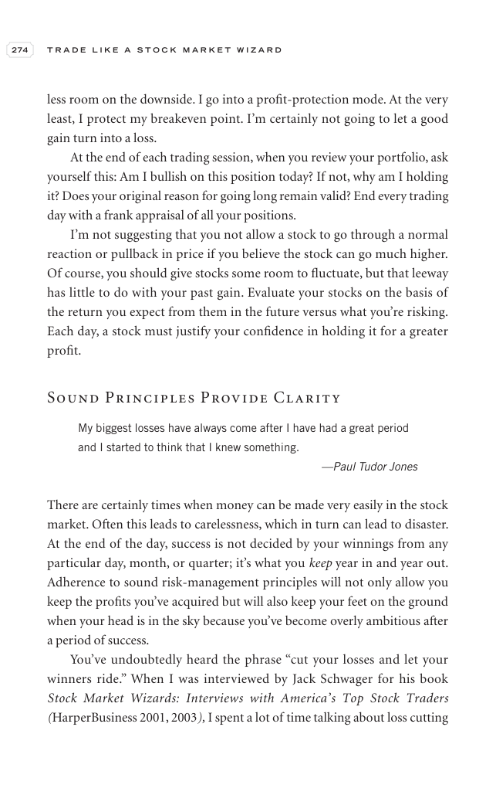

# Trade Like a Stock Market Wizard - Page Image 289

## Source Page

Book: [[Trade Like a Stock Market Wizard]]

## Page Read

Tags: risk-first, visual-concept-page

Concepts: [[Mental Discipline]], [[Risk First]]

This is a visual teaching page without a clean ticker/date case. The useful work is to read the image as a concept illustration rather than forcing a market-data reconstruction.

## Linked Stock Figures

- No extracted stock-figure case on this page.

## Extracted Page Text Signal

274 T R A D E L I K E A S T O C K M A R K E T W I Z A R D less room on the downside. I go into a profit-protection mode. At the very least, I protect my breakeven point. I’m certainly not going to let a good gain turn into a loss. At the end of each trading session, when you review your portfolio, ask yourself this: Am I bullish on this position today? If not, why am I holding it? Does your original reason for going long remain valid? End every trading day with a frank appraisal of all your posit...

## Manual Study Prompt

- What visual structure is the page trying to make obvious?
- Is the lesson about buying, avoiding, selling, or managing risk?
- If a ticker is not present, what generic behavior does the image teach?
- If a ticker is present, does the linked OHLCV rebuild confirm the same behavior?
