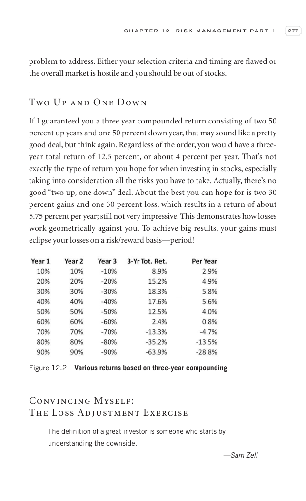

# Trade Like a Stock Market Wizard - Page Image 292

## Source Page

Book: [[Trade Like a Stock Market Wizard]]

## Page Read

Tags: manual-review-needed, risk-first, stock-chart-page

Concepts: [[Mental Discipline]], [[Risk First]]

This page contains one or more stock-chart figures already reconciled in the stock-image layer. Study the source page first for the visual lesson, then open the linked case notes to compare it against rebuilt OHLCV data.

## Linked Stock Figures

- [[Trade Like a Stock Market Wizard - Figure 12-2 - manual-review - page 292]] - manual - manual-review-needed

## Extracted Page Text Signal

C H A P T E R 1 2 R I S K M A N A G E M E N T P A R T 1 277 problem to address. Either your selection criteria and timing are flawed or the overall market is hostile and you should be out of stocks. Two Up and One Down If I guaranteed you a three year compounded return consisting of two 50 percent up years and one 50 percent down year, that may sound like a pretty good deal, but think again. Regardless of the order, you would have a three- year total return of 12.5 percent, or about 4 percent per...

## Manual Study Prompt

- What visual structure is the page trying to make obvious?
- Is the lesson about buying, avoiding, selling, or managing risk?
- If a ticker is not present, what generic behavior does the image teach?
- If a ticker is present, does the linked OHLCV rebuild confirm the same behavior?
