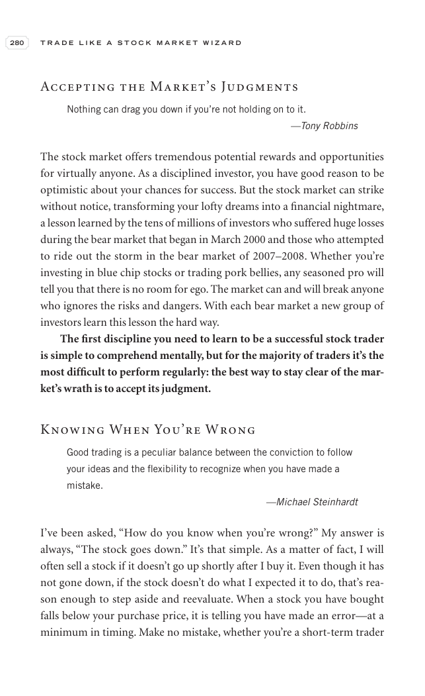

# Trade Like a Stock Market Wizard - Page Image 295

## Source Page

Book: [[Trade Like a Stock Market Wizard]]

## Page Read

Tags: mental-discipline, risk-first, sell-or-failure, visual-concept-page

Concepts: [[Mental Discipline]], [[Risk First]], [[Sell Rules and Failure Signals]]

This is a visual teaching page without a clean ticker/date case. The useful work is to read the image as a concept illustration rather than forcing a market-data reconstruction.

## Linked Stock Figures

- No extracted stock-figure case on this page.

## Extracted Page Text Signal

280 T R A D E L I K E A S T O C K M A R K E T W I Z A R D Accepting the Market’s Judgments Nothing can drag you down if you’re not holding on to it. -Tony Robbins The stock market offers tremendous potential rewards and opportunities for virtually anyone. As a disciplined investor, you have good reason to be optimistic about your chances for success. But the stock market can strike without notice, transforming your lofty dreams into a financial nightmare, a lesson learned by the tens of millions ...

## Manual Study Prompt

- What visual structure is the page trying to make obvious?
- Is the lesson about buying, avoiding, selling, or managing risk?
- If a ticker is not present, what generic behavior does the image teach?
- If a ticker is present, does the linked OHLCV rebuild confirm the same behavior?
