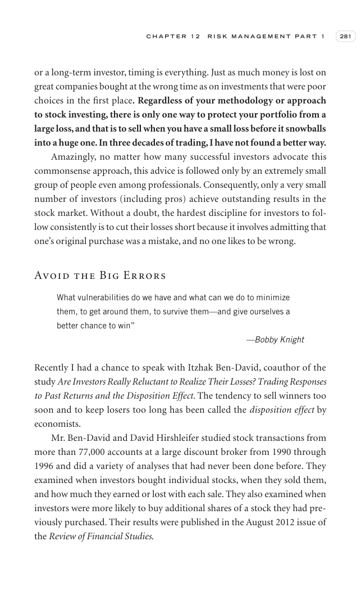

# Trade Like a Stock Market Wizard - Page Image 296

## Source Page

Book: [[Trade Like a Stock Market Wizard]]

## Page Read

Tags: mental-discipline, sell-or-failure, visual-concept-page

Concepts: [[Mental Discipline]], [[Sell Rules and Failure Signals]]

This is a visual teaching page without a clean ticker/date case. The useful work is to read the image as a concept illustration rather than forcing a market-data reconstruction.

## Linked Stock Figures

- No extracted stock-figure case on this page.

## Extracted Page Text Signal

C H A P T E R 1 2 R I S K M A N A G E M E N T P A R T 1 281 or a long-term investor, timing is everything. Just as much money is lost on great companies bought at the wrong time as on investments that were poor choices in the first place. Regardless of your methodology or approach to stock investing, there is only one way to protect your portfolio from a large loss, and that is to sell when you have a small loss before it snowballs into a huge one. In three decades of trading, I have not found a ...

## Manual Study Prompt

- What visual structure is the page trying to make obvious?
- Is the lesson about buying, avoiding, selling, or managing risk?
- If a ticker is not present, what generic behavior does the image teach?
- If a ticker is present, does the linked OHLCV rebuild confirm the same behavior?
