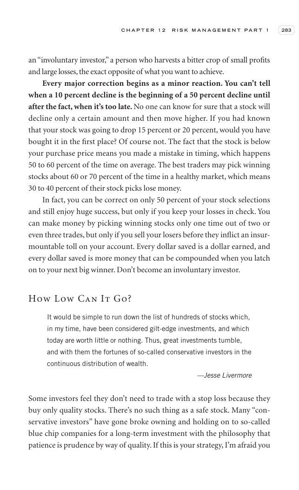

# Trade Like a Stock Market Wizard - Page Image 298

## Source Page

Book: [[Trade Like a Stock Market Wizard]]

## Page Read

Tags: mental-discipline, sell-or-failure, visual-concept-page

Concepts: [[Mental Discipline]], [[Sell Rules and Failure Signals]]

This is a visual teaching page without a clean ticker/date case. The useful work is to read the image as a concept illustration rather than forcing a market-data reconstruction.

## Linked Stock Figures

- No extracted stock-figure case on this page.

## Extracted Page Text Signal

C H A P T E R 1 2 R I S K M A N A G E M E N T P A R T 1 283 an “involuntary investor,” a person who harvests a bitter crop of small profits and large losses, the exact opposite of what you want to achieve. Every major correction begins as a minor reaction. You can’t tell when a 10 percent decline is the beginning of a 50 percent decline until after the fact, when it’s too late. No one can know for sure that a stock will decline only a certain amount and then move higher. If you had known that you...

## Manual Study Prompt

- What visual structure is the page trying to make obvious?
- Is the lesson about buying, avoiding, selling, or managing risk?
- If a ticker is not present, what generic behavior does the image teach?
- If a ticker is present, does the linked OHLCV rebuild confirm the same behavior?
