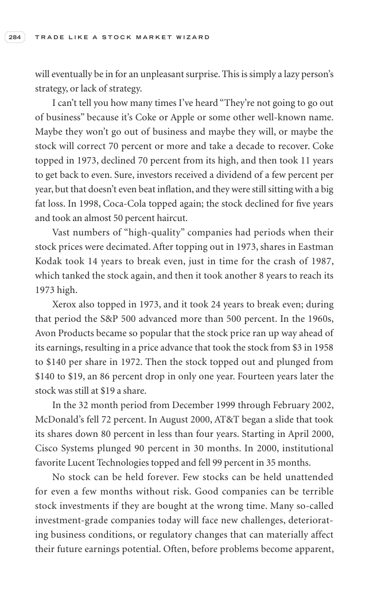

# Trade Like a Stock Market Wizard - Page Image 299

## Source Page

Book: [[Trade Like a Stock Market Wizard]]

## Page Read

Tags: visual-concept-page

Concepts: [[Mental Discipline]]

This is a visual teaching page without a clean ticker/date case. The useful work is to read the image as a concept illustration rather than forcing a market-data reconstruction.

## Linked Stock Figures

- No extracted stock-figure case on this page.

## Extracted Page Text Signal

284 T R A D E L I K E A S T O C K M A R K E T W I Z A R D will eventually be in for an unpleasant surprise. This is simply a lazy person’s strategy, or lack of strategy. I can’t tell you how many times I’ve heard “They’re not going to go out of business” because it’s Coke or Apple or some other well-known name. Maybe they won’t go out of business and maybe they will, or maybe the stock will correct 70 percent or more and take a decade to recover. Coke topped in 1973, declined 70 percent from its...

## Manual Study Prompt

- What visual structure is the page trying to make obvious?
- Is the lesson about buying, avoiding, selling, or managing risk?
- If a ticker is not present, what generic behavior does the image teach?
- If a ticker is present, does the linked OHLCV rebuild confirm the same behavior?
