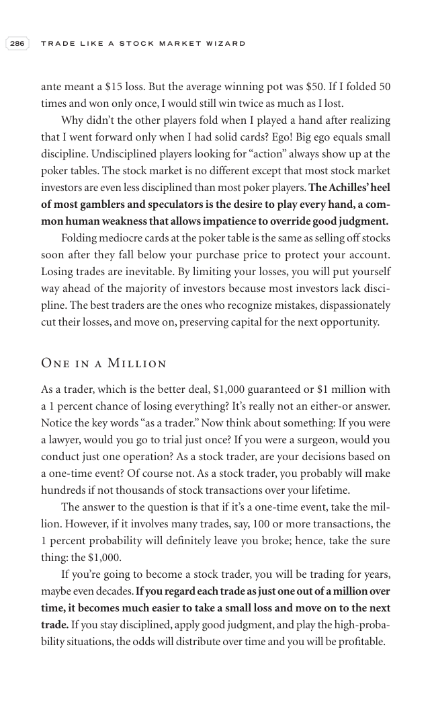

# Trade Like a Stock Market Wizard - Page Image 301

## Source Page

Book: [[Trade Like a Stock Market Wizard]]

## Page Read

Tags: mental-discipline, sell-or-failure, visual-concept-page

Concepts: [[Mental Discipline]], [[Sell Rules and Failure Signals]]

This is a visual teaching page without a clean ticker/date case. The useful work is to read the image as a concept illustration rather than forcing a market-data reconstruction.

## Linked Stock Figures

- No extracted stock-figure case on this page.

## Extracted Page Text Signal

286 T R A D E L I K E A S T O C K M A R K E T W I Z A R D ante meant a $15 loss. But the average winning pot was $50. If I folded 50 times and won only once, I would still win twice as much as I lost. Why didn’t the other players fold when I played a hand after realizing that I went forward only when I had solid cards? Ego! Big ego equals small discipline. Undisciplined players looking for “action” always show up at the poker tables. The stock market is no different except that most stock market...

## Manual Study Prompt

- What visual structure is the page trying to make obvious?
- Is the lesson about buying, avoiding, selling, or managing risk?
- If a ticker is not present, what generic behavior does the image teach?
- If a ticker is present, does the linked OHLCV rebuild confirm the same behavior?
