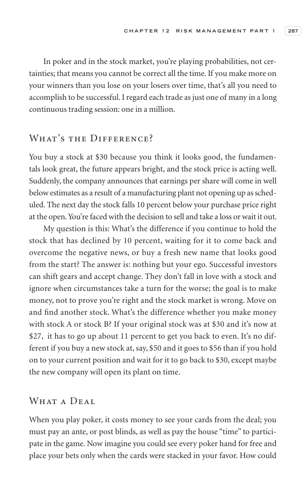

# Trade Like a Stock Market Wizard - Page Image 302

## Source Page

Book: [[Trade Like a Stock Market Wizard]]

## Page Read

Tags: sell-or-failure, visual-concept-page

Concepts: [[Mental Discipline]], [[Sell Rules and Failure Signals]]

This is a visual teaching page without a clean ticker/date case. The useful work is to read the image as a concept illustration rather than forcing a market-data reconstruction.

## Linked Stock Figures

- No extracted stock-figure case on this page.

## Extracted Page Text Signal

C H A P T E R 1 2 R I S K M A N A G E M E N T P A R T 1 287 In poker and in the stock market, you’re playing probabilities, not cer- tainties; that means you cannot be correct all the time. If you make more on your winners than you lose on your losers over time, that’s all you need to accomplish to be successful. I regard each trade as just one of many in a long continuous trading session: one in a million. What’s the Difference? You buy a stock at $30 because you think it looks good, the fundam...

## Manual Study Prompt

- What visual structure is the page trying to make obvious?
- Is the lesson about buying, avoiding, selling, or managing risk?
- If a ticker is not present, what generic behavior does the image teach?
- If a ticker is present, does the linked OHLCV rebuild confirm the same behavior?
