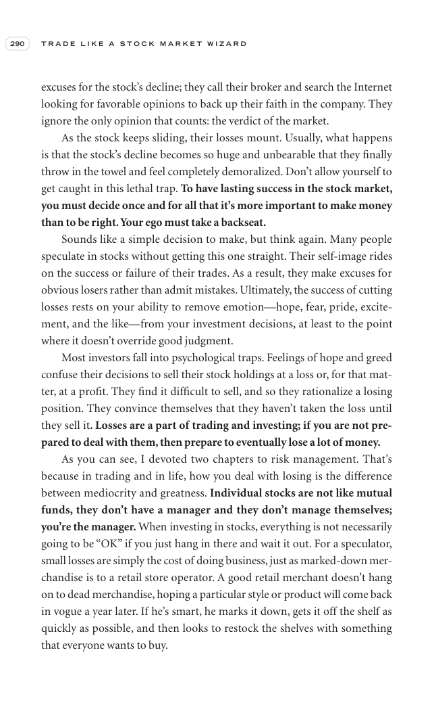

# Trade Like a Stock Market Wizard - Page Image 305

## Source Page

Book: [[Trade Like a Stock Market Wizard]]

## Page Read

Tags: mental-discipline, sell-or-failure, visual-concept-page

Concepts: [[Mental Discipline]], [[Sell Rules and Failure Signals]]

This is a visual teaching page without a clean ticker/date case. The useful work is to read the image as a concept illustration rather than forcing a market-data reconstruction.

## Linked Stock Figures

- No extracted stock-figure case on this page.

## Extracted Page Text Signal

290 T R A D E L I K E A S T O C K M A R K E T W I Z A R D excuses for the stock’s decline; they call their broker and search the Internet looking for favorable opinions to back up their faith in the company. They ignore the only opinion that counts: the verdict of the market. As the stock keeps sliding, their losses mount. Usually, what happens is that the stock’s decline becomes so huge and unbearable that they finally throw in the towel and feel completely demoralized. Don’t allow yourself to g...

## Manual Study Prompt

- What visual structure is the page trying to make obvious?
- Is the lesson about buying, avoiding, selling, or managing risk?
- If a ticker is not present, what generic behavior does the image teach?
- If a ticker is present, does the linked OHLCV rebuild confirm the same behavior?
