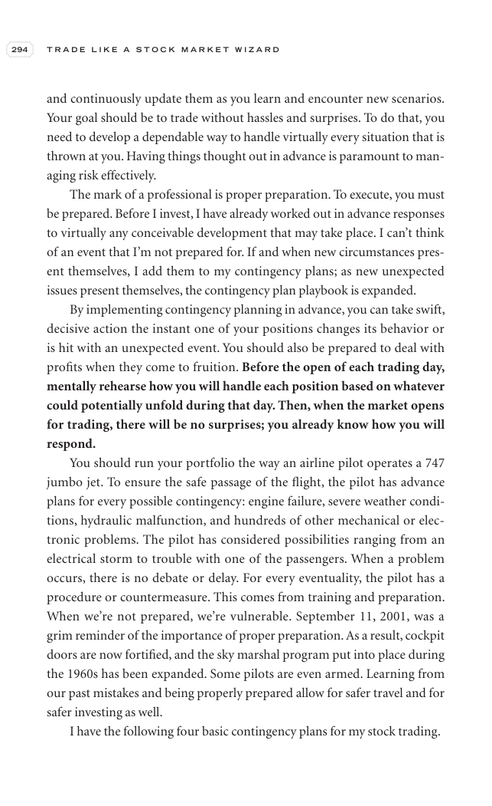

# Trade Like a Stock Market Wizard - Page Image 309

## Source Page

Book: [[Trade Like a Stock Market Wizard]]

## Page Read

Tags: risk-first, sell-or-failure, visual-concept-page

Concepts: [[Mental Discipline]], [[Risk First]], [[Sell Rules and Failure Signals]]

This is a visual teaching page without a clean ticker/date case. The useful work is to read the image as a concept illustration rather than forcing a market-data reconstruction.

## Linked Stock Figures

- No extracted stock-figure case on this page.

## Extracted Page Text Signal

294 T R A D E L I K E A S T O C K M A R K E T W I Z A R D and continuously update them as you learn and encounter new scenarios. Your goal should be to trade without hassles and surprises. To do that, you need to develop a dependable way to handle virtually every situation that is thrown at you. Having things thought out in advance is paramount to man- aging risk effectively. The mark of a professional is proper preparation. To execute, you must be prepared. Before I invest, I have already worke...

## Manual Study Prompt

- What visual structure is the page trying to make obvious?
- Is the lesson about buying, avoiding, selling, or managing risk?
- If a ticker is not present, what generic behavior does the image teach?
- If a ticker is present, does the linked OHLCV rebuild confirm the same behavior?
