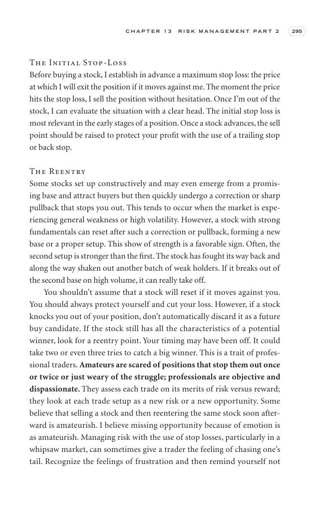

# Trade Like a Stock Market Wizard - Page Image 310

## Source Page

Book: [[Trade Like a Stock Market Wizard]]

## Page Read

Tags: risk-first, sell-or-failure, visual-concept-page, volume-behavior

Concepts: [[Mental Discipline]], [[Risk First]], [[Sell Rules and Failure Signals]], [[Volume Dry-Up and Accumulation]]

This is a visual teaching page without a clean ticker/date case. The useful work is to read the image as a concept illustration rather than forcing a market-data reconstruction.

## Linked Stock Figures

- No extracted stock-figure case on this page.

## Extracted Page Text Signal

C H A P T E R 1 3 R I S K M A N A G E M E N T P A R T 2 295 The Initial Stop-Loss Before buying a stock, I establish in advance a maximum stop loss: the price at which I will exit the position if it moves against me. The moment the price hits the stop loss, I sell the position without hesitation. Once I’m out of the stock, I can evaluate the situation with a clear head. The initial stop loss is most relevant in the early stages of a position. Once a stock advances, the sell point should be raise...

## Manual Study Prompt

- What visual structure is the page trying to make obvious?
- Is the lesson about buying, avoiding, selling, or managing risk?
- If a ticker is not present, what generic behavior does the image teach?
- If a ticker is present, does the linked OHLCV rebuild confirm the same behavior?
