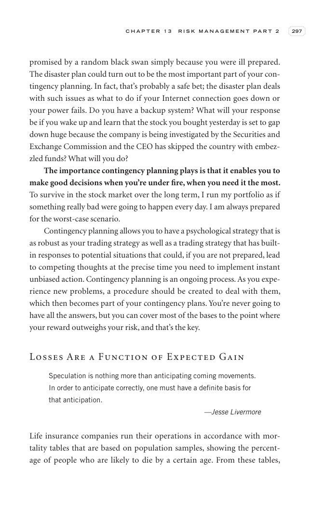

# Trade Like a Stock Market Wizard - Page Image 312

## Source Page

Book: [[Trade Like a Stock Market Wizard]]

## Page Read

Tags: visual-concept-page

Concepts: [[Mental Discipline]]

This is a visual teaching page without a clean ticker/date case. The useful work is to read the image as a concept illustration rather than forcing a market-data reconstruction.

## Linked Stock Figures

- No extracted stock-figure case on this page.

## Extracted Page Text Signal

C H A P T E R 1 3 R I S K M A N A G E M E N T P A R T 2 297 promised by a random black swan simply because you were ill prepared. The disaster plan could turn out to be the most important part of your con- tingency planning. In fact, that’s probably a safe bet; the disaster plan deals with such issues as what to do if your Internet connection goes down or your power fails. Do you have a backup system? What will your response be if you wake up and learn that the stock you bought yesterday is set ...

## Manual Study Prompt

- What visual structure is the page trying to make obvious?
- Is the lesson about buying, avoiding, selling, or managing risk?
- If a ticker is not present, what generic behavior does the image teach?
- If a ticker is present, does the linked OHLCV rebuild confirm the same behavior?
