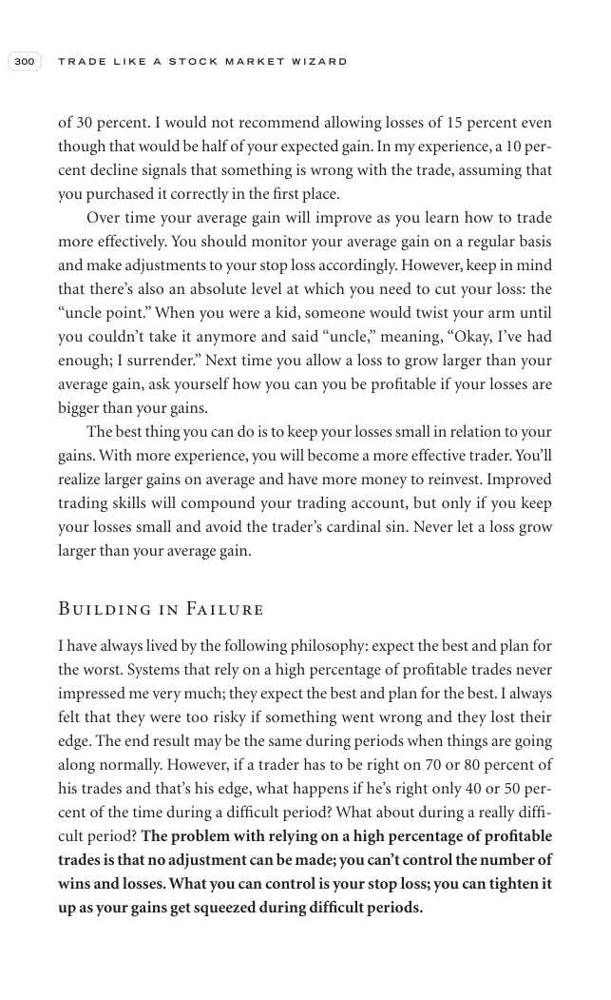

# Trade Like a Stock Market Wizard - Page Image 315

## Source Page

Book: [[Trade Like a Stock Market Wizard]]

## Page Read

Tags: risk-first, sell-or-failure, visual-concept-page

Concepts: [[Mental Discipline]], [[Risk First]], [[Sell Rules and Failure Signals]]

This is a visual teaching page without a clean ticker/date case. The useful work is to read the image as a concept illustration rather than forcing a market-data reconstruction.

## Linked Stock Figures

- No extracted stock-figure case on this page.

## Extracted Page Text Signal

300 T R A D E L I K E A S T O C K M A R K E T W I Z A R D of 30 percent. I would not recommend allowing losses of 15 percent even though that would be half of your expected gain. In my experience, a 10 per- cent decline signals that something is wrong with the trade, assuming that you purchased it correctly in the first place. Over time your average gain will improve as you learn how to trade more effectively. You should monitor your average gain on a regular basis and make adjustments to your st...

## Manual Study Prompt

- What visual structure is the page trying to make obvious?
- Is the lesson about buying, avoiding, selling, or managing risk?
- If a ticker is not present, what generic behavior does the image teach?
- If a ticker is present, does the linked OHLCV rebuild confirm the same behavior?
