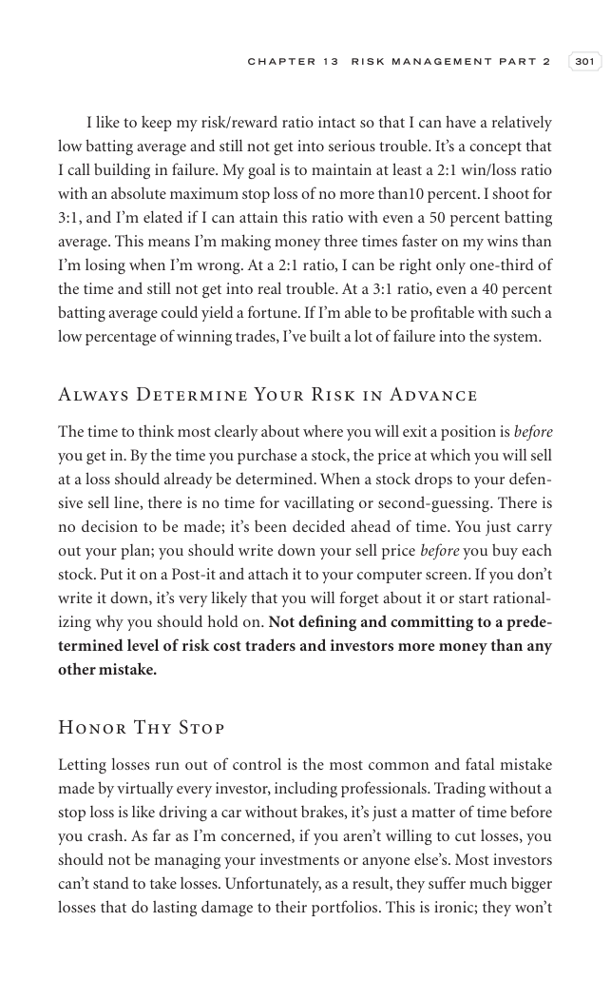

# Trade Like a Stock Market Wizard - Page Image 316

## Source Page

Book: [[Trade Like a Stock Market Wizard]]

## Page Read

Tags: risk-first, sell-or-failure, visual-concept-page

Concepts: [[Mental Discipline]], [[Risk First]], [[Sell Rules and Failure Signals]]

This is a visual teaching page without a clean ticker/date case. The useful work is to read the image as a concept illustration rather than forcing a market-data reconstruction.

## Linked Stock Figures

- No extracted stock-figure case on this page.

## Extracted Page Text Signal

C H A P T E R 1 3 R I S K M A N A G E M E N T P A R T 2 301 I like to keep my risk/reward ratio intact so that I can have a relatively low batting average and still not get into serious trouble. It’s a concept that I call building in failure. My goal is to maintain at least a 2:1 win/loss ratio with an absolute maximum stop loss of no more than10 percent. I shoot for 3:1, and I’m elated if I can attain this ratio with even a 50 percent batting average. This means I’m making money three times fas...

## Manual Study Prompt

- What visual structure is the page trying to make obvious?
- Is the lesson about buying, avoiding, selling, or managing risk?
- If a ticker is not present, what generic behavior does the image teach?
- If a ticker is present, does the linked OHLCV rebuild confirm the same behavior?
