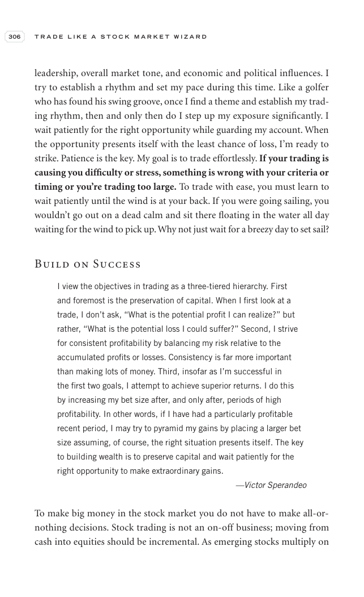

# Trade Like a Stock Market Wizard - Page Image 321

## Source Page

Book: [[Trade Like a Stock Market Wizard]]

## Page Read

Tags: risk-first, visual-concept-page

Concepts: [[Mental Discipline]], [[Risk First]]

This is a visual teaching page without a clean ticker/date case. The useful work is to read the image as a concept illustration rather than forcing a market-data reconstruction.

## Linked Stock Figures

- No extracted stock-figure case on this page.

## Extracted Page Text Signal

306 T R A D E L I K E A S T O C K M A R K E T W I Z A R D leadership, overall market tone, and economic and political influences. I try to establish a rhythm and set my pace during this time. Like a golfer who has found his swing groove, once I find a theme and establish my trad- ing rhythm, then and only then do I step up my exposure significantly. I wait patiently for the right opportunity while guarding my account. When the opportunity presents itself with the least chance of loss, I’m ready to ...

## Manual Study Prompt

- What visual structure is the page trying to make obvious?
- Is the lesson about buying, avoiding, selling, or managing risk?
- If a ticker is not present, what generic behavior does the image teach?
- If a ticker is present, does the linked OHLCV rebuild confirm the same behavior?
