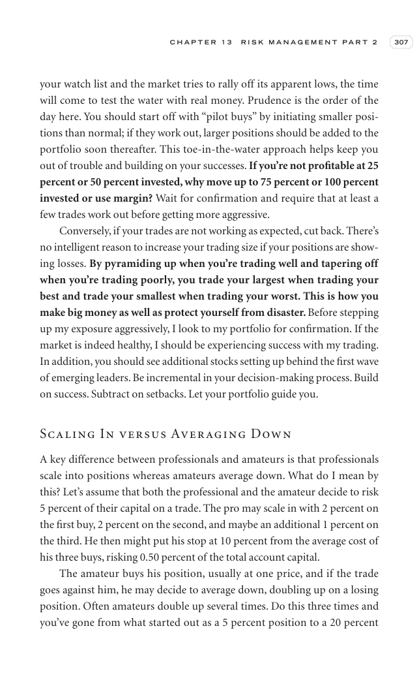

# Trade Like a Stock Market Wizard - Page Image 322

## Source Page

Book: [[Trade Like a Stock Market Wizard]]

## Page Read

Tags: visual-concept-page

Concepts: [[Mental Discipline]]

This is a visual teaching page without a clean ticker/date case. The useful work is to read the image as a concept illustration rather than forcing a market-data reconstruction.

## Linked Stock Figures

- No extracted stock-figure case on this page.

## Extracted Page Text Signal

C H A P T E R 1 3 R I S K M A N A G E M E N T P A R T 2 307 your watch list and the market tries to rally off its apparent lows, the time will come to test the water with real money. Prudence is the order of the day here. You should start off with “pilot buys” by initiating smaller posi- tions than normal; if they work out, larger positions should be added to the portfolio soon thereafter. This toe-in-the-water approach helps keep you out of trouble and building on your successes. If you’re not ...

## Manual Study Prompt

- What visual structure is the page trying to make obvious?
- Is the lesson about buying, avoiding, selling, or managing risk?
- If a ticker is not present, what generic behavior does the image teach?
- If a ticker is present, does the linked OHLCV rebuild confirm the same behavior?
