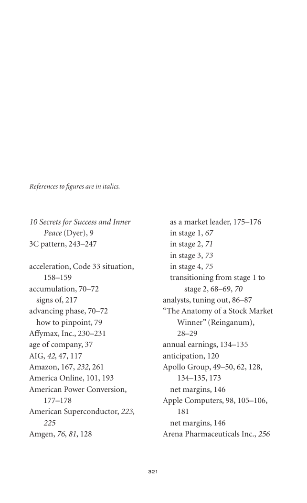

# Trade Like a Stock Market Wizard - Page Image 336

## Source Page

Book: [[Trade Like a Stock Market Wizard]]

## Page Read

Tags: stage-2-uptrend, visual-concept-page

Concepts: [[Mental Discipline]], [[Stage 2 Uptrend]]

This is a visual teaching page without a clean ticker/date case. The useful work is to read the image as a concept illustration rather than forcing a market-data reconstruction.

## Linked Stock Figures

- No extracted stock-figure case on this page.

## Extracted Page Text Signal

321 10 Secrets for Success and Inner Peace (Dyer), 9 3C pattern, 243-247 acceleration, Code 33 situation, 158-159 accumulation, 70-72 signs of, 217 advancing phase, 70-72 how to pinpoint, 79 Affymax, Inc., 230-231 age of company, 37 AIG, 42, 47, 117 Amazon, 167, 232, 261 America Online, 101, 193 American Power Conversion, 177-178 American Superconductor, 223, 225 Amgen, 76, 81, 128 as a market leader, 175-176 in stage 1, 67 in stage 2, 71 in stage 3, 73 in stage 4, 75 transitioning from stage 1 ...

## Manual Study Prompt

- What visual structure is the page trying to make obvious?
- Is the lesson about buying, avoiding, selling, or managing risk?
- If a ticker is not present, what generic behavior does the image teach?
- If a ticker is present, does the linked OHLCV rebuild confirm the same behavior?
