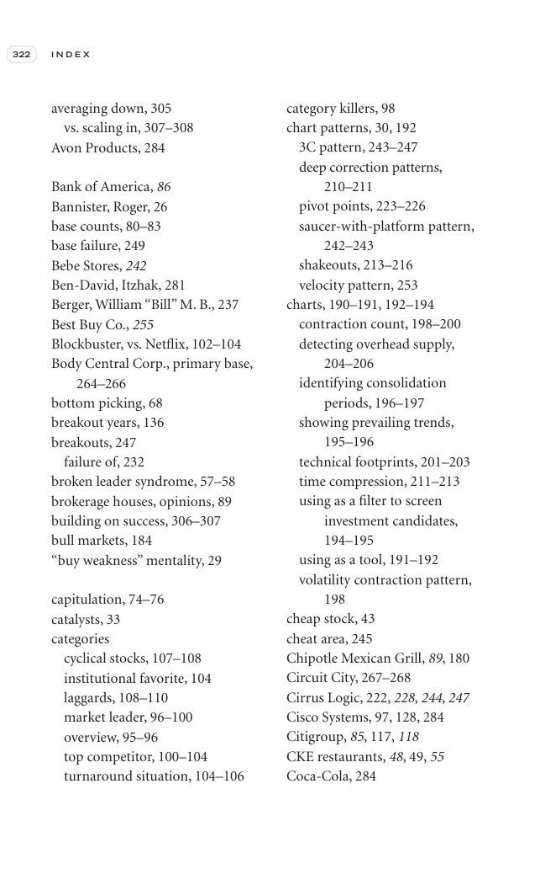

# Trade Like a Stock Market Wizard - Page Image 337

## Source Page

Book: [[Trade Like a Stock Market Wizard]]

## Page Read

Tags: ipo-or-new-issue, pivot-or-entry, sell-or-failure, vcp-or-tightening, visual-concept-page

Concepts: [[IPO Base New Issue Setup|IPO Base / New Issue Setup]], [[Mental Discipline]], [[Pivot and Entry]], [[Sell Rules and Failure Signals]], [[Volatility Contraction Pattern]]

This is a visual teaching page without a clean ticker/date case. The useful work is to read the image as a concept illustration rather than forcing a market-data reconstruction.

## Linked Stock Figures

- No extracted stock-figure case on this page.

## Extracted Page Text Signal

322 I N D E X averaging down, 305 vs. scaling in, 307-308 Avon Products, 284 Bank of America, 86 Bannister, Roger, 26 base counts, 80-83 base failure, 249 Bebe Stores, 242 Ben-David, Itzhak, 281 Berger, William “Bill” M. B., 237 Best Buy Co., 255 Blockbuster, vs. Netflix, 102-104 Body Central Corp., primary base, 264-266 bottom picking, 68 breakout years, 136 breakouts, 247 failure of, 232 broken leader syndrome, 57-58 brokerage houses, opinions, 89 building on success, 306-307 bull markets, 184 ...

## Manual Study Prompt

- What visual structure is the page trying to make obvious?
- Is the lesson about buying, avoiding, selling, or managing risk?
- If a ticker is not present, what generic behavior does the image teach?
- If a ticker is present, does the linked OHLCV rebuild confirm the same behavior?
