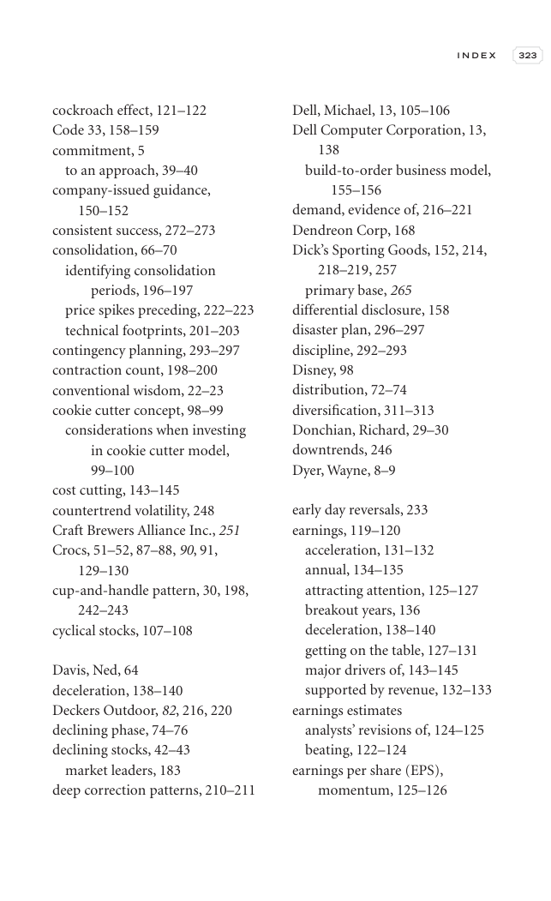

# Trade Like a Stock Market Wizard - Page Image 338

## Source Page

Book: [[Trade Like a Stock Market Wizard]]

## Page Read

Tags: mental-discipline, pivot-or-entry, vcp-or-tightening, visual-concept-page

Concepts: [[Mental Discipline]], [[Pivot and Entry]], [[Volatility Contraction Pattern]]

This is a visual teaching page without a clean ticker/date case. The useful work is to read the image as a concept illustration rather than forcing a market-data reconstruction.

## Linked Stock Figures

- No extracted stock-figure case on this page.

## Extracted Page Text Signal

I N D E X 323 cockroach effect, 121-122 Code 33, 158-159 commitment, 5 to an approach, 39-40 company-issued guidance, 150-152 consistent success, 272-273 consolidation, 66-70 identifying consolidation periods, 196-197 price spikes preceding, 222-223 technical footprints, 201-203 contingency planning, 293-297 contraction count, 198-200 conventional wisdom, 22-23 cookie cutter concept, 98-99 considerations when investing in cookie cutter model, 99-100 cost cutting, 143-145 countertrend volatility,...

## Manual Study Prompt

- What visual structure is the page trying to make obvious?
- Is the lesson about buying, avoiding, selling, or managing risk?
- If a ticker is not present, what generic behavior does the image teach?
- If a ticker is present, does the linked OHLCV rebuild confirm the same behavior?
